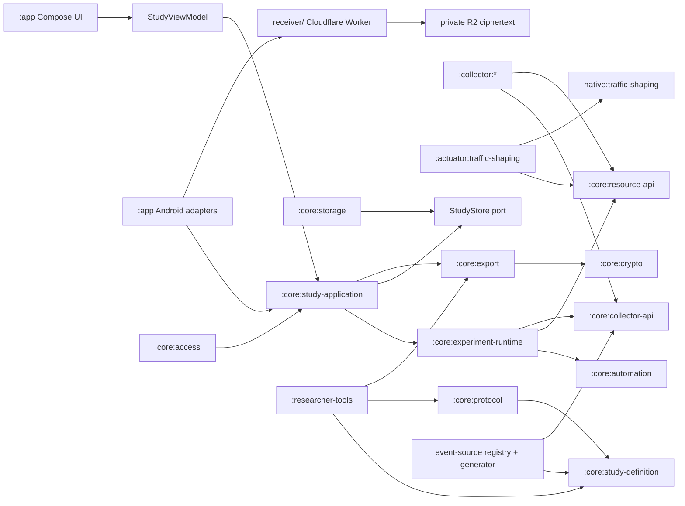

# Particeps

**Participant-first sensing for research.** Run a mobile data collection study without building an app. A study is a signed configuration file: choose which collectors to run, set their parameters and the study duration, sign it, and hand it to participants. Data is collected on the device and encrypted as it is written. It reaches you as an encrypted export the participant sends, or on a schedule if the study names an upload endpoint.

[](https://github.com/JacobLinCool/particeps/actions/workflows/ci.yml)
[](LICENSE)
[-3DDC84.svg)](#requirements)

Standing up a mobile sensing study normally means writing an Android app, getting permissions right, handling background execution, and building a data pipeline — before collecting a single sample. This platform does that part once. Designing a new study means writing a JSON file and signing it.

### The name

*Particeps* is Latin for one who takes part or shares in something, and it is the root of *participant*.

The name describes where the design puts the participant, and it is worth being exact about what that does and does not mean. Events are written and encrypted on the participant's own phone. Every collector a study enables is shown to them before they are asked to consent, with what it records and what it cannot establish. Nothing is collected until they press Start. Those are defaults the implementation actually provides.

What the name does not grant is authorship of the study. The collector set, the duration, and whether the study uploads on a schedule are fixed in the signed configuration. A participant cannot change them, add to them, or recall a bundle once it has been delivered. Their leverage over a running study is bounded and real — decline it outright, withhold the Android access an *optional* collector needs so that collector stays off, pause, withdraw, and delete the local data. A collector the configuration marks required is not optional in that sense: withholding its access stops the study rather than trimming it.

## How a study works

1. **Generate your keys.** One Ed25519 pair to sign study configurations, one X25519 HPKE pair to decrypt bundles. `researcher-tools` writes raw 32-byte keys as unpadded base64url.
2. **Write the study.** A strict Protocol v1 RFC 8785 JSON file naming collector profiles,
   reusable actions/surveys, declarative automations, optional traffic-shaping profiles, identity
   mode, duration, storage quota, consent text, and signing/export public keys.
3. **Sign it.** `researcher-tools sign` produces a `.partcfg` file that any build of the app can verify, with no change to the app.
4. **Distribute.** Participants install the app and import your `.partcfg`, or open a `particeps://join/v1` link that names where those exact bytes are served and pins their SHA-256. Setup is five steps, one screen each: the study details, what each enabled collector records and does not record, the consent text with the signer's key fingerprint, the Android access the study and its collectors need, and the start button. Collection begins only when they press the start button.
5. **Run.** Collector and actuator resources follow the signed automations. Ordered observations,
   decisions, resource receipts, condition epochs, and events are committed to encrypted on-device
   storage. Participants can pause, resume, complete, or withdraw.
6. **Export and analyse.** The participant exports an encrypted bundle and sends it to you. If the study declares an upload endpoint, the app also delivers immutable ciphertext bundles to an R2 receiver on a schedule. `particeps-analysis` inventories, verifies, decrypts, reassembles, and writes typed Parquet offline.

The full procedure, including key handling and study design guidance, is in the [researcher guide](docs/researcher-guide.md).

## What you can collect

Twelve selectable collectors ship in v1. A study declares named settings for the ones it uses and
binds them through closed-world automations within generated validation bounds.

| Collector | Records |
| --- | --- |
| `app_lifecycle.v1` | Lifecycle of this app's own activities |
| `accelerometer.v1` | Raw x/y/z acceleration, sensor time, accuracy |
| `battery_state.v1` | Battery percentage, charging state/source, power-save state |
| `temporal_context.v1` | Time-zone ID, UTC offset, DST state, clock-change reason |
| `gyroscope.v1` | Raw x/y/z angular velocity, sensor time, accuracy |
| `ambient_light.v1` | Raw illuminance, sensor time, accuracy |
| `proximity.v1` | Raw distance, sensor range, near/far interpretation |
| `network_state.v1` | Default network transport, validated/metered/roaming/VPN flags, bandwidth estimates |
| `network_usage.v1` | Device-total Wi-Fi and mobile rx/tx bytes and packets per interval |
| `usage_events.v1` | Raw app, screen, keyguard, and boot events |
| `location.v1` | Fused Location fixes with accuracy, speed, altitude, bearing |
| `keyboard_touch.v1` | Within-key touch position, timing, pressure, size, key category |

What each collector cannot establish is set out per collector in the [researcher guide](docs/researcher-guide.md), which is where a study is designed; field-level definitions of every event, including units and timestamp semantics, are in the [data dictionary](docs/data-dictionary.md).

Some practical notes: package names, location, fine-grained timing, acceleration, and keyboard dynamics can all be identifying, and ethics review will ask about that. Choosing the fewest collectors, the lowest usable rate, and the shortest duration that answers your question makes both the review and the analysis easier.

Android studies can additionally declare local per-App traffic shaping. Signed target packages share
aggregate uplink/downlink limits through a local `VpnService`; unselected apps bypass it. The VPN is
not a Particeps gateway and records no payload, destination, DNS name, installed-app inventory, or
per-App flow. See the [researcher guide](docs/researcher-guide.md#8-traffic-shaping-resource).

## Adding a collector

The collector set is meant to grow. A collector is a Gradle module implementing three things: a typed configuration that appears in the signed study file, a plugin descriptor declaring what access it needs, and a runtime instance that observes its source and emits events.

Collector modules depend only on `core:collector-api`, `core:study-definition`, and exactly two
narrow shared helpers where applicable: `collector:sensor-common` owns Android hardware-sensor
listener lifecycle, while `collector:usage-common` owns the single Usage Access AppOps probe used
by UsageStats-backed sources. A new data source does not touch storage, the runtime, or
protocol/export code. The
[implementation guide](docs/data-collector-implementation-guide.md) walks through the contract and every registration step.

## Participant data protection

Studies collect from people's personal phones, so the platform is built to support a defensible ethics submission and honest commitments to participants.

- **Encrypted, authenticated commits on the device.** Each study uses a non-exportable Android
  Keystore AES-256-GCM key. Complete append-only `EngineCommit` frames bind source observations,
  events, reducer state, timers/actions/resources, condition epochs, and successor projection.
  Encrypted snapshots are recovery caches; the authenticated commit chain is the incremental truth.
- **Signed, tamper-evident studies.** A configuration is Ed25519-signed and strictly validated: RFC 8785 bytes, exact schema, known collectors, Android platform, validity window, and minimum client build. Verification failures are fail-closed — an unverifiable configuration collects nothing. A signature proves the configuration is unchanged since it was signed; it does not prove who wrote it unless the build pins that signer, and the consent screen states which of the two applies.
- **Durable event-driven actions and resources.** A pure, bounded reducer consumes only committed
  collector/system facts. One-time, interval, daily, random-window, event, sequence, window, and
  state conditions produce durable timers, one-shot outbox actions, or desired resource profiles.
  Random choices and action IDs become durable before Android work. Native survey answers enter the
  log only as one validated final submission.
- **Separated participant identities.** Every import gets a fresh random instance UUID. A configuration may additionally carry an opaque researcher-assigned code; both appear in the encrypted document. Upload URLs and headers contain no participant, assigned, experiment, or configuration ID. Their bundle UUID, configuration digest, researcher key ID, exact range/count, size, and digest are untrusted routing claims, not participant authentication.
- **Encrypted, participant-directed export.** Getting data to the research team is an export the participant performs and directs, encrypted with a fresh key per export and wrapped to your HPKE public key. The app never holds your private key.
- **Commit-boundary upload, when the study asks for it.** A configuration may name an HTTPS endpoint,
  interval, and metered-network policy. Before HTTP starts, the app stages one immutable ciphertext
  bundle containing complete commits. Retries send exact bytes. Only a canonical receipt matching
  UUID, digest, size, configuration, commit range/count, and event count advances the contiguous
  watermark; undelivered input is never reclaimed.
- **Participant control over lifecycle.** Start/Resume applies and verifies every required resource
  before opening one condition-epoch admission token. Pause/Complete/Withdraw closes admission first,
  flushes retrospective sources at one boundary, records final resource evidence, closes the epoch,
  and releases resources. Automation cannot override those controls.
- **Failures stop admission.** Storage, required collector, VPN, package, permission, native, or
  resource-verification failure closes the event gate and durably pauses rather than silently
  accepting an unproven interval.
- **No automatic recovery into collection.** Process death or reboot from an active internal state
  recovers fail-closed to Paused, records the quality gap, and requires explicit participant Resume.
  Active-running time does not advance while paused and retrospective collectors never backfill the
  unverified interval.
- **Participant UI is intentionally stable.** The existing five setup steps and compact running
  controls remain. A traffic-shaping study adds one fixed high-level inline disclosure and Android's
  mandatory permission/VPN consent, not a trigger/treatment/rate/history dashboard or second ongoing
  notification.

### Who published the study

One published app can verify and run any researcher's study. The cost is that a signature alone says nothing about origin: the researcher name and contact shown on the consent screen are text the signer chose. The mitigation is the signing key fingerprint, which the consent step shows under the heading *Configuration signature*. Publish your fingerprint in the material that recruits participants so they can compare the two. Note also that a participant reaches a study through your recruitment channel rather than an anonymous download. How the signing key travels inside the signed bytes, and how its fingerprint is derived, is in the [threat model](docs/threat-model.md).

The shipped build pins no signer, so it accepts any correctly signed configuration and tells the participant that the publisher is unverified. An institution that wants one build to run only its own studies adds its key to `TRUSTED_SIGNING_KEYS` in `CollectorApplication` and ships that build; every other signer is then refused outright.

For ethics reviewers, the [threat model](docs/threat-model.md) documents the trust assumptions and, more usefully, what the design does *not* protect against.

## Quick start

### Requirements

JDK 17, and Android SDK platform and build tools for API 37. The app targets Android 14 through 17 (`minSdk 34`, `compileSdk`/`targetSdk 37`).

### Build and test

The build and test command block, the emulator-attached suites, and the sensor setup the collector integration test expects are in [CONTRIBUTING.md](CONTRIBUTING.md#development).

### Try it without a real study

`researcher-tools/examples` contains a demonstration study and its key pair. Those keys are public fixtures committed to this repository, fine for development and emulator testing but never for real participants, and a release build ships no demonstration study at all — see [`researcher-tools/examples/README.md`](researcher-tools/examples/README.md). Build the debug variant if you want to try the participant flow without a configuration of your own.

### Researcher CLI

```text
signing-keygen   generate an Ed25519 signing pair
hpke-keygen      generate a raw X25519 HPKE key pair
canonicalize     strictly parse and emit a canonical configuration
sign             sign a canonical configuration into .partcfg
personalize      sign one canonical configuration and .partcfg per row of an assigned-code mapping
check-config     verify envelope, signature, platform, validity window, and client build; optionally pin the signer
decrypt          decrypt a .partexp into particeps-research-bundle-v1 JSON
```

## Architecture



| Module | Responsibility |
| --- | --- |
| `:app` | Compose UI, finite UI state, SAF, and Android foreground/work/recovery/upload adapters |
| `:core:model` | Event, clock, timer, outbox, condition-epoch, checkpoint, and authenticated commit DTOs |
| `:core:study-definition` | Strict canonical JSON, signed automation AST, and generated collector-profile codecs |
| `:core:protocol` | Signed envelope, immutable join URI, signature verification, optional signer pinning, validity and version checks |
| `:core:collector-api` | Generated event-source contracts, observation batches, collector lifecycle, access, and flushing |
| `:core:resource-api` | Generation-bound contracts and receipts for stateful collectors and actuators |
| `:core:automation` | Closed-world compiler, graph validation, pure reducer, and durable timer producers |
| `:core:crypto` | Protocol v1 raw-key Ed25519 verification and fixed-suite RFC 9180 HPKE over raw X25519 keys; Tink is internal only, never a wire keyset |
| `:core:access` | Runtime permission, Usage Access, input method, and hardware preflight |
| `:core:experiment-runtime` | The sole coordinator for lifecycle, deterministic reduction, barriers, epochs, timers, outbox, and admission |
| `:core:study-application` | The single active-study session and participant-safe application projection |
| `:core:storage` | Keystore-backed authenticated `EngineCommit` frames, snapshots, pending input, and commit-boundary reclamation |
| `:core:export` | Commit-boundary streaming export, verification, HPKE key wrapping, and receipts |
| `:collector:*` | One isolated module per data source |
| `:actuator:traffic-shaping` | Android `VpnService` and the generation-verified traffic-shaping resource adapter |
| `native:traffic-shaping` | Source-built Go/gVisor packet forwarder and aggregate bidirectional token buckets |
| `:researcher-tools` | Ed25519 and HPKE keys, canonicalise, sign, verify, decrypt CLI |
| `receiver/` | One bounded Protocol v1 upload POST, immutable ciphertext writes, and canonical receipts |

Platform-independent modules contain no `android.*` imports, which keeps the domain logic testable on the JVM. [System design](docs/system-design.md) documents the module contracts.

New contributors should treat [`protocol/v1`](protocol/v1/README.md) as the normative wire contract, the [event-source registry](protocol/v1/event-source-registry.json) as the sole typed source/profile schema, and [`docs/system-design.md`](docs/system-design.md) for how the modules fit together. Trace one path through the [configuration codec](core/study-definition/src/main/kotlin/cool/jacoblin/particeps/core/definition/StudyConfigurationCodec.kt), [signed envelope](core/protocol/src/main/kotlin/cool/jacoblin/particeps/core/protocol/SignedConfiguration.kt), [bundle exporter](core/export/src/main/kotlin/cool/jacoblin/particeps/core/export/ResearchExport.kt), [bundle verifier](core/export/src/main/kotlin/cool/jacoblin/particeps/core/export/ResearchBundleVerifier.kt), [single-entry outbox](app/src/main/kotlin/cool/jacoblin/particeps/platform/FileUploadOutbox.kt), [HTTP adapter](app/src/main/kotlin/cool/jacoblin/particeps/platform/OkHttpStudyUploader.kt), [receiver handler](receiver/src/index.ts), and the offline [`particeps-analysis`](particeps-analysis/README.md) pipeline. The join path is similarly short: [Web authoring](web/src/lib/particeps/join.ts), [shared parser](core/protocol/src/main/kotlin/cool/jacoblin/particeps/core/protocol/JoinLink.kt), [Android staging](app/src/main/kotlin/cool/jacoblin/particeps/platform/JoinArtifactDownloader.kt), [intent entry](app/src/main/kotlin/cool/jacoblin/particeps/MainActivity.kt), then the existing [session import](core/study-application/src/main/kotlin/cool/jacoblin/particeps/core/application/StudyApplication.kt). The [outbox](app/src/test/kotlin/cool/jacoblin/particeps/platform/FileUploadOutboxTest.kt), [uploader](app/src/test/kotlin/cool/jacoblin/particeps/platform/OkHttpStudyUploaderTest.kt), and [receiver](receiver/tests/receiver.test.ts) tests make crash/replay and receipt semantics executable. Receiver deployment and R2 operations start at [`receiver/README.md`](receiver/README.md), and the Collector capability policy lives under [`assurance`](assurance/README.md).

For `random_window`, trace the signed schedule in
[`AutomationDefinitions.kt`](core/study-definition/src/main/kotlin/cool/jacoblin/particeps/core/definition/AutomationDefinitions.kt),
the generic timer producer in
[`Timers.kt`](core/automation/src/main/kotlin/cool/jacoblin/particeps/core/automation/Timers.kt), and the
single coordinator in
[`ExperimentRuntime.kt`](core/experiment-runtime/src/main/kotlin/cool/jacoblin/particeps/core/runtime/ExperimentRuntime.kt).
The selected deadline becomes durable before Android receives a wakeup request; the wakeup carries
only the timer identity and generation, and the same deterministic reducer reconciles retries,
pause, reboot, clock, and time-zone changes. Random scheduling therefore has no parallel planner,
event log, occurrence store, or action path.

## Documentation

| Document | For |
| --- | --- |
| [Changelog](CHANGELOG.md) | What changed between releases, and what it asks of an existing install |
| [Researcher guide](docs/researcher-guide.md) | Designing, signing, deploying, and analysing a study |
| [Data dictionary](docs/data-dictionary.md) | Every field on every event, per collector |
| [Participant guide](docs/participant-guide.md) | People taking part in a study |
| [Collector implementation guide](docs/data-collector-implementation-guide.md) | Writing a new collector |
| [System design](docs/system-design.md) | The implemented v1 architecture in full |
| [Threat model](docs/threat-model.md) | Trust assumptions and limitations, for ethics review |
| [Normative Protocol v1](protocol/v1/README.md) | JCS, keys, join URI, binary framing, bundle document, upload, receipt, and conformance corpora |
| [Collector capability policy](assurance/README.md) | Static source, bytecode, and dependency boundaries for collectors |
| [Ciphertext receiver](receiver/README.md) | R2-only Worker contract, verification commands, deployment, and operations |
| [Offline analysis](particeps-analysis/README.md) | Ciphertext inventory, verification, reassembly, and typed Parquet materialization |
| [Release process](docs/maintainers/release.md) | Maintainers |

## Contributing

New collectors are the main contribution path — see [CONTRIBUTING.md](CONTRIBUTING.md) and the [implementation guide](docs/data-collector-implementation-guide.md). To report a security or privacy issue, see [SECURITY.md](SECURITY.md) rather than opening a public issue.

## Coming from an earlier release candidate

`v1.0.0-rc.5` established the current application ID and the production signing certificate recorded
in the repository's [auditable identity anchor](.github/android-release-signing-certificate.sha256),
so Android can install a newer APK over rc.5 and rc.6. That application-level continuity does not
preserve study data. This event-driven Protocol v1 cut rejects every earlier signed configuration,
store, schedule, bundle, and upload receipt; there is no legacy reader, migration, converter, or
fallback. The app uses its existing participant-confirmed generic recovery/reset flow for an
incompatible local store and never silently deletes or uploads it.

Rc.4 and earlier use another application ID, signing certificate, or file identity and cannot be
installed over the current app. Those older apps keep running under their own identity until
removed. Uninstalling destroys their Keystore key and everything encrypted under it, so export
anything still needed first.
[CHANGELOG.md](CHANGELOG.md) says which release carries which identity, which spellings it retired,
and what each release asks of an existing install.

## Status

This repository implements and tests the full local participant flow on Android 14–17.

**The app's own screens ship in English and Traditional Chinese.** The interface follows the phone's system language, and a picker in the app's header changes it for this app alone. That picker writes through Android's `LocaleManager`, so it is the same setting as the system's per-app language screen rather than a second one beside it. Adding a language is a `values-*` directory and one line in `res/xml/locales_config.xml`.

Researcher-supplied text is a separate matter. The study title, purpose, researcher name, contact, and consent summary are rendered exactly as they were signed, in whatever language they were written, whatever language the app is in. Recruiting across languages therefore means one signed configuration per language.

Running a real study also needs work this repository cannot do for you: ethics and legal approval, your own study signing key and a published fingerprint for it, a data governance plan, and validation on the physical devices and OEM builds you intend to support. Emulator tests passing is not ethics approval, Play policy compliance, or scientific validity.

## License and citation

MIT — see [LICENSE](LICENSE). If you use this platform in published work, please cite it using the metadata in [CITATION.cff](CITATION.cff).
