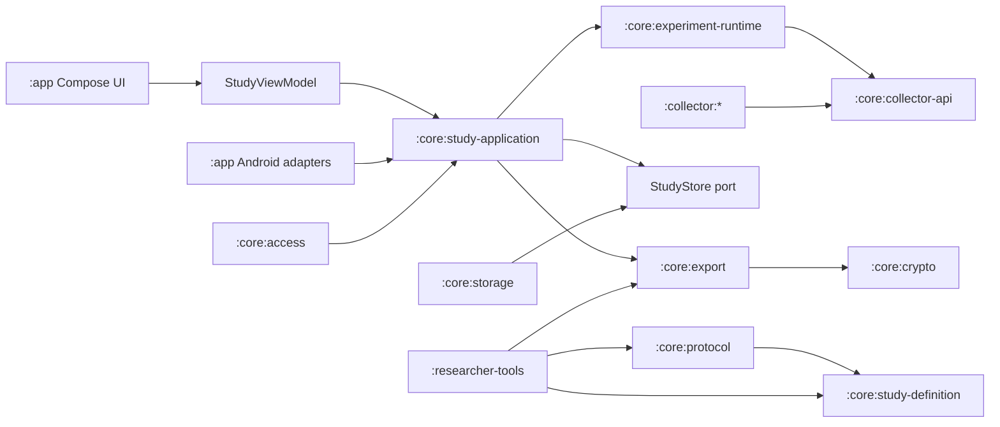

# Android Data Collector

Run a mobile data collection study without building an app. A study is a signed configuration file: choose which collectors to run, set their parameters and the study duration, sign it, and hand it to participants. Data is collected on the device and encrypted as it is written; it reaches you as an encrypted export the participant sends, or on a schedule if the study names an upload endpoint.

[](https://github.com/JacobLinCool/android-data-collector/actions/workflows/ci.yml)
[](LICENSE)
[-3DDC84.svg)](#requirements)

Standing up a mobile sensing study normally means writing an Android app, getting permissions right, handling background execution, and building a data pipeline — before collecting a single sample. This platform does that part once. Designing a new study means writing a JSON file and signing it.

## How a study works

1. **Generate your keys.** One Ed25519 pair to sign study configurations, one HPKE pair to decrypt exports. `researcher-tools` does both.
2. **Write the study.** A strict v1 JSON file naming collectors, reusable surveys, scheduled interventions, anonymous or assigned-code identity mode, duration, storage quota, consent text, and signing/export public keys.
3. **Sign it.** `researcher-tools sign` produces a `.adccfg` file. Because the signing public key travels inside the signed bytes, any build of the app can verify it.
4. **Distribute.** Participants install the app and import your `.adccfg`. Setup is five steps, one screen each — the study details, what each enabled collector records and does not record, the consent text with the signer's key fingerprint, the Android access your collectors need, and the start button — and collection begins only when they press it.
5. **Collect.** Events are written to encrypted on-device storage. Participants can pause, resume, finish early, or withdraw.
6. **Export and analyse.** The participant exports an encrypted bundle and sends it to you. If the study declares an upload endpoint, the app also delivers the same encrypted bundles to it on a schedule. `researcher-tools decrypt` turns either one into JSON.

The full procedure, including key handling and study design guidance, is in the [researcher guide](docs/researcher-guide.md).

## What you can collect

Seven collectors ship in v1. A study enables the ones it names and configures each one's parameters within validated ranges.

| Collector | Records | Cannot establish |
| --- | --- | --- |
| `app_lifecycle.v1` | Lifecycle of this app's own activities | Use of any other app |
| `accelerometer.v1` | Raw x/y/z acceleration, sensor time, accuracy | Recognised motion, posture, or activity |
| `network_state.v1` | Default network transport, validated/metered/roaming/VPN flags, bandwidth estimates | Addresses, destinations, or content |
| `network_usage.v1` | Device-total Wi-Fi and mobile rx/tx bytes and packets per interval | Instantaneous throughput, per-app attribution, exact timing |
| `usage_events.v1` | Raw app, screen, keyguard, and boot events | A complete or real-time session stream |
| `location.v1` | Fused Location fixes with accuracy, speed, altitude, bearing | Correct or gap-free position |
| `keyboard_touch.v1` | Within-key touch position, timing, pressure, size, key category | System-wide touch, or the text that was typed |

The right-hand column is there because it saves work later: it is the set of claims the data cannot carry into a paper, no matter how the analysis is written. Field-level definitions of every event, including units and timestamp semantics, are in the [data dictionary](docs/data-dictionary.md).

Some practical notes: package names, location, fine-grained timing, acceleration, and keyboard dynamics can all be identifying, and ethics review will ask about that. Choosing the fewest collectors, the lowest usable rate, and the shortest duration that answers your question makes both the review and the analysis easier.

## Adding a collector

The collector set is meant to grow. A collector is a Gradle module implementing three things: a typed configuration that appears in the signed study file, a plugin descriptor declaring what access it needs, and a runtime instance that observes its source and emits events.

Collector modules depend only on `core:collector-api` and `core:study-definition`, so a new data source does not touch storage, the runtime, or the protocol layer. The [implementation guide](docs/data-collector-implementation-guide.md) walks through the contract and every registration step, with a complete worked example.

## Participant data protection

Studies collect from people's personal phones, so the platform is built to support a defensible ethics submission and honest commitments to participants.

- **Encrypted on the device.** Each study's events and metadata are encrypted with a per-study AES-256-GCM key from the Android Keystore, marked non-exportable, in 4 MiB event segments under the app's no-backup storage, up to the quota the configuration set. An event is appended once and never rewritten; the only thing that removes a segment is confirmed delivery to the study's endpoint, and then only under storage pressure.
- **Signed, tamper-evident studies.** A configuration is Ed25519-signed and strictly validated: canonical encoding, exact schema, known collectors, validity window, minimum app version. Verification failures are fail-closed — an unverifiable configuration collects nothing. A signature proves the configuration is unchanged since it was signed; it does not prove who wrote it unless the build pins that signer, and the consent screen states which of the two applies.
- **Durable interventions and native surveys.** Notification actions can use one-time, recurring, or daily-local triggers. Their occurrences survive retries and reboot without duplication. Native surveys support short text, integer scales, single choice, and multiple choice; only a confirmed, complete submission enters the encrypted event stream.
- **Separated participant identities.** Every import gets a fresh random instance UUID. A configuration may additionally carry an opaque researcher-assigned code; both appear inside encrypted exports, while upload headers expose only the instance UUID used for routing and de-duplication.
- **Encrypted, participant-directed export.** Getting data to the research team is an export the participant performs and directs, encrypted with a fresh key per export and wrapped to your HPKE public key. The app never holds your private key.
- **Scheduled upload, when the study asks for it.** A configuration may name an HTTPS endpoint, interval, and metered-network policy. The endpoint host, cadence, and network condition are shown before consent. Each run sends outstanding events up to a 16 MiB plaintext budget and records its exact boundary. Finishing or withdrawing cancels future interventions and the deadline, while delivery continues until the undelivered tail arrives. Undelivered events are never reclaimed to make room.
- **Participant control over the lifecycle.** Collection starts only on an explicit action and can be paused, finished, or withdrawn. Pausing takes a monotonic boundary, so delayed callbacks cannot leak post-pause data into the dataset.
- **Storage failures stop collection.** Quota exhaustion or a write failure fail-closes the study to `PAUSED` rather than silently dropping events, so a dataset is complete over the window it declares or absent.

### Who published the study

A configuration carries its own signing public key in a mandatory `signer` block, so one published app can verify any researcher's study without a rebuild. The cost is that a signature alone says nothing about origin: the researcher name and contact shown on the consent screen are text the signer chose. The mitigation is the key fingerprint — the first 16 bytes of SHA-256 over the signing public key, rendered as eight groups of four hex characters — which the consent step shows under the heading *Configuration signature*. Publish your fingerprint in the material that recruits participants so they can compare the two, and note that a participant reaches a study through your recruitment channel rather than an anonymous download.

The shipped build pins no signer, so it accepts any correctly signed configuration and tells the participant that the publisher is unverified. An institution that wants one build to run only its own studies adds its key to `TRUSTED_SIGNING_KEYS` in `CollectorApplication` and ships that build; every other signer is then refused outright.

For ethics reviewers, the [threat model](docs/threat-model.md) documents the trust assumptions and, more usefully, what the design does *not* protect against.

## Quick start

### Requirements

JDK 17, and Android SDK platform and build tools for API 37. The app targets Android 14 through 17 (`minSdk 34`, `compileSdk`/`targetSdk 37`).

### Build and test

```bash
./gradlew test testDebugUnitTest lintDebug assembleDebug assembleRelease
```

With an emulator or device attached:

```bash
./gradlew :core:storage:connectedDebugAndroidTest :app:connectedDebugAndroidTest
```

The debug APK lands at `app/build/outputs/apk/debug/app-debug.apk`. A clean checkout has no signing material, so `assembleRelease` produces an unsigned release APK.

### Try it without a real study

`researcher-tools/examples` contains a demonstration study and its key pair. Those keys are public fixtures committed to this repository: anyone can sign a configuration that presents itself as the demo study, and anyone can decrypt an export encrypted to the demo HPKE key. They are fine for development and emulator testing, never for real participants.

For that reason a **release build ships no demonstration study** — the signed envelope and its loader are in the app's `debug` source set only, so a released app runs nothing but a study a research team signed and handed out. Build the debug variant if you want to try the participant flow without a configuration of your own.

### Researcher CLI

```text
signing-keygen   generate an Ed25519 signing pair
hpke-keygen      generate a Tink HPKE keyset pair
canonicalize     strictly parse and emit a canonical configuration
sign             sign a canonical configuration into .adccfg
check-config     verify envelope, signature, validity window, app version; optionally pin the signer
decrypt          decrypt an .adcexp into research-bundle-v1 JSON
```

## Architecture



| Module | Responsibility |
| --- | --- |
| `:app` | Compose UI, finite UI state, SAF, and Android foreground/work/recovery/upload adapters |
| `:core:model` | Bounded study metadata, state and event models, `StudyStore` port and its retained window |
| `:core:study-definition` | Strict canonical JSON, closed-world typed study and collector configuration |
| `:core:protocol` | Signed envelope, signature verification, optional signer pinning, validity and version checks |
| `:core:collector-api` | Collector lifecycle, health, registry, access contract, shared callback dispatcher |
| `:core:crypto` | Tink HPKE key generation, wrapping, and unwrapping |
| `:core:access` | Runtime permission, Usage Access, input method, and hardware preflight |
| `:core:experiment-runtime` | Command serialisation, state machine, collector supervision, event admission gate |
| `:core:study-application` | The single active-study session, recovery, port coordination, and the upload watermark |
| `:core:storage` | Keystore-backed encrypted metadata, appended event segments, and reclaiming delivered ones |
| `:core:export` | Streaming JSON to AES-GCM over a sequence window under an optional size budget, HPKE key wrapping, receipts |
| `:collector:*` | One isolated module per data source |
| `:researcher-tools` | Ed25519 and HPKE keys, canonicalise, sign, verify, decrypt CLI |

Platform-independent modules contain no `android.*` imports, which keeps the domain logic testable on the JVM. [Component boundaries](docs/component-boundaries.md) documents the contracts.

## Documentation

| Document | For |
| --- | --- |
| [Researcher guide](docs/researcher-guide.md) | Designing, signing, deploying, and analysing a study |
| [Data dictionary](docs/data-dictionary.md) | Every field on every event, per collector |
| [Participant guide](docs/participant-guide.md) | People taking part in a study |
| [Collector implementation guide](docs/data-collector-implementation-guide.md) | Writing a new collector |
| [System design](docs/system-design.md) | The implemented v1 architecture in full |
| [Component boundaries](docs/component-boundaries.md) | Module contracts and invariants |
| [Threat model](docs/threat-model.md) | Trust assumptions and limitations, for ethics review |
| [Release process](docs/maintainers/release.md) | Maintainers |

## Contributing

New collectors are the main contribution path — see [CONTRIBUTING.md](CONTRIBUTING.md) and the [implementation guide](docs/data-collector-implementation-guide.md). To report a security or privacy issue, see [SECURITY.md](SECURITY.md) rather than opening a public issue.

## Status

This repository implements and tests the full local participant flow on Android 14–17.

**The app's own screens ship in English and Traditional Chinese.** The interface follows the phone's system language, and a picker in the app's header changes it for this app alone; that picker writes through Android's `LocaleManager`, so it is the same setting as the system's per-app language screen rather than a second one beside it. Adding a language is a `values-*` directory and one line in `res/xml/locales_config.xml`.

Researcher-supplied text is a separate matter: the study title, purpose, researcher name, contact, and consent summary are rendered exactly as they were signed, in whatever language they were written, whatever language the app is in. Recruiting across languages therefore means one signed configuration per language.

Running a real study also needs work this repository cannot do for you: ethics and legal approval, your own study signing key and a published fingerprint for it, a data governance plan, and validation on the physical devices and OEM builds you intend to support. Emulator tests passing is not ethics approval, Play policy compliance, or scientific validity.

## License and citation

MIT — see [LICENSE](LICENSE). If you use this platform in published work, please cite it using the metadata in [CITATION.cff](CITATION.cff).
