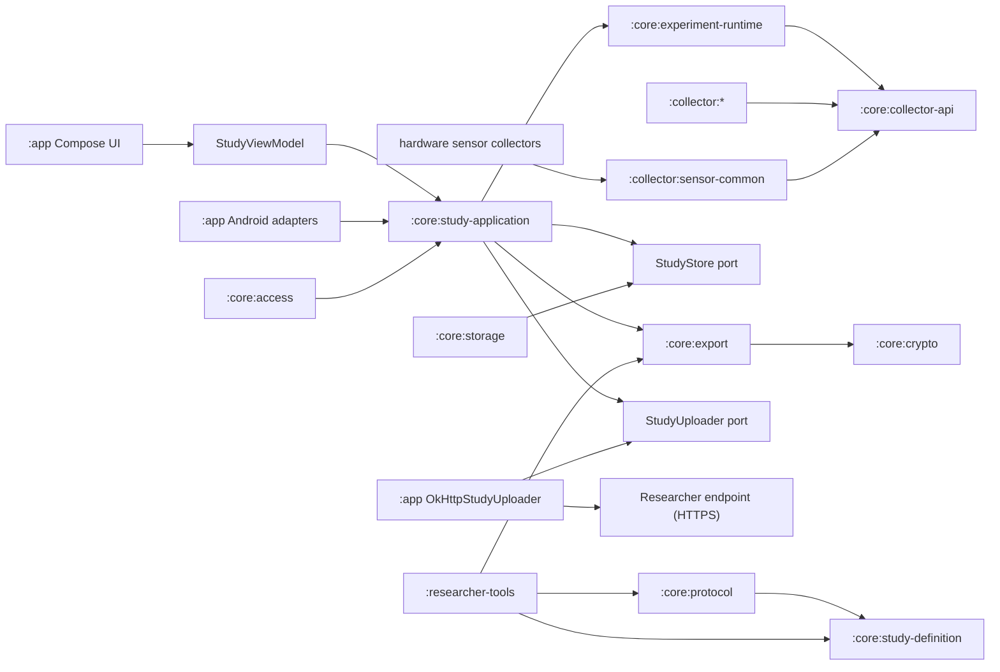
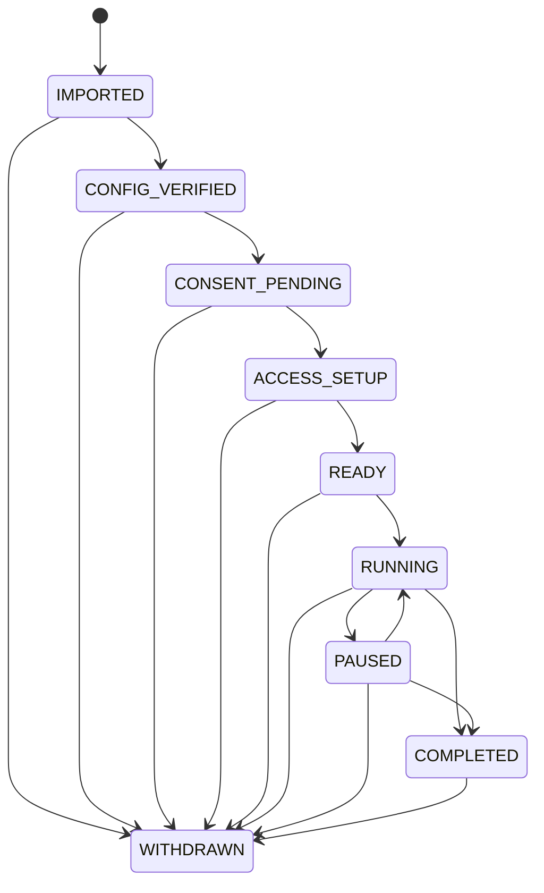

# Particeps system design

This document describes the system as it exists in this repository today, not a roadmap. The
platform is a local-first, single-study, participant-controlled Android data collection app. A
study configuration can only select collectors that are already compiled into the APK. It cannot
download or execute arbitrary code. Collection and storage never require the network; delivery to
a researcher endpoint is an option a study configuration turns on.

The [normative Protocol v1 contract](../protocol/v1/README.md) and its
[collector catalog](../protocol/v1/collector-catalog.json) define the wire and event schemas.
[`assurance`](../assurance/README.md) defines the static Collector capability policy. This document
explains how the current modules realize those contracts.

## 1. Goals and boundaries

- Android 14-17 (`minSdk 34`, `compileSdk`/`targetSdk 37`).
- A signed v1 study configuration determines study content, participant identity mode, collectors,
  localized surveys, intervention actions and triggers, local storage quota, export key, and upload.
- Every study event is encrypted on the device before it is stored, and nothing leaves the device
  in plaintext.
- Data reaches the researcher two ways. The first is an export the participant directs. The second
  is scheduled delivery of the same encrypted bundles to the endpoint the configuration names, and
  it exists only when that configuration carries a populated `upload` block. Both are ciphertext
  wrapped to the researcher's HPKE key. Upload is a property of the study, not a participant
  setting, and it is disclosed on the consent screen from the signed bytes.
- Collection begins only after the participant explicitly starts it. The participant can pause,
  resume, finish early, withdraw, export, and delete. Collection never depends on upload
  succeeding.
- `RUNNING`, `PAUSED`, `COMPLETED`, and `WITHDRAWN` can all be exported, repeatedly. Export is not a
  study state.

### Outside the current scope

For readers sizing up what a study can and cannot do, the following are not implemented, and no
study configuration can turn them on:

- Touch data exists only inside the study keyboard; there is no system-wide touch monitoring and no
  accessibility service.
- The study IME does not record characters, committed text, surrounding text, clipboard content, or
  suggestions.
- Network collectors read connection state and device-total counters. No SSID, BSSID, IP address,
  DNS query, URL, packet, or payload is recorded.
- Nothing external can start, stop, or reconfigure a running study. Upload is outbound only: the
  worker posts a bundle and uses the response status code, and no inbound message reaches the
  runtime.
- Collectors store raw sensor readings and derive no activity or posture labels from them.

## 2. Module architecture



| Module | Responsibility |
| --- | --- |
| `:app` | Compose interface and localized resources, bounded UI state, SAF, Android foreground/work/recovery adapters, single-entry upload outbox, and HTTP adapter |
| `:core:model` | Bounded study metadata, the state and event model, and the `StudyStore` port with its retained-window contract |
| `:core:study-definition` | Strict canonical JSON, closed-world typed study and collector configuration |
| `:core:protocol` | Signed envelope, immutable join URI, signature verification, optional signer pinning, validity-window and version checks |
| `:core:collector-api` | Collector lifecycle, health, registry, access contract, and the shared callback dispatcher |
| `:core:crypto` | Protocol v1 raw-key Ed25519 verification and fixed-suite RFC 9180 HPKE over raw X25519 keys; Tink remains internal only, never a wire keyset |
| `:core:access` | Closed Android access rules: semantic order, prerequisites, runtime-permission/settings/picker actions, Usage Access, input-method state, and hardware preflight |
| `:core:experiment-runtime` | Command serialization, state machine, collector supervision, event admission gate, durable occurrence lifecycle, and atomic survey submission |
| `:core:study-application` | The single active-study session; recovery and coordination of storage/access/host/work/export/upload ports, schedule reconciliation, and the upload watermark |
| `:core:storage` | Android Keystore, encrypted metadata, appended event segments, reclaiming delivered ones, and strict one-event journal recovery |
| `:core:export` | Authenticated JCS/AES-GCM bundle construction over an exact sequence window, HPKE wrapping, closed-world streaming bundle verification, provenance, and strict receipt parsing |
| `:collector:*` | One independent module per data source |
| `:collector:sensor-common` | Listener-thread ownership shared only by raw Android hardware-sensor collectors; no schema, inference, or storage policy |
| `:researcher-tools` | CLI for Ed25519/HPKE key generation, canonicalization, signing, configuration checking, and decryption (`signing-keygen`, `hpke-keygen`, `canonicalize`, `sign`, `personalize`, `check-config`, `decrypt`) |

A collector feature depends on `collector-api`, `study-definition`, and, for raw hardware listener
ownership only, `collector:sensor-common`. This is the sole collector-to-collector dependency and
the capability policy scans it with the feature modules. A collector emits through `EventSink`
only. It cannot see storage or the runtime, change state directly, write files, export, or request
permissions.
`CollectorRegistry` rejects an ID that is not compiled in, and rejects duplicate IDs at
construction.

### Access planning and acquisition

Access declaration, study policy, Android acquisition, and presentation are deliberately separate.
Each `CollectorDescriptor` carries a closed `Set<AccessKind>` alongside its event contract. A
collector plugin has no `accessRequirements` callback and cannot provide a permission string,
`Intent`, UI text, or action. For each configured collector, `CollectorRegistry` combines those
descriptor capabilities with the configuration's `required` flag and emits
`CollectorAccessRequirement` values that retain the descriptor ID as owner.

`StudyAccessPolicy` adds one unconditional required `NOTIFICATIONS` owner for the study's status,
ongoing collection, and scheduled activities, then groups all requirements by `AccessKind`. The
group keeps every `StudyAccessOwner`; its merged requirement is required when any owner is required.
Shared Usage Access for `network_usage.v1` and `usage_events.v1` is therefore acquired once without
losing which collector requested it or either collector's optionality.

`:core:access` owns an exhaustive `AccessRules` entry for every `AccessKind`. A rule fixes semantic
order, prerequisites, an optional closed `SetupAction`, and optional app-authored guidance. Fine
location precedes request-specific Android location-service readiness, which precedes background
location; background location remains blocked until both earlier capabilities are satisfied and
then uses the system App details screen. Enabling the research keyboard precedes
selecting it; the first uses input-method settings and the second the system input-method picker.
Notifications and foreground location are runtime-permission actions, Usage Access uses its system
settings screen, and hardware capabilities have no action. Settings intents are resolved to a
system component; a missing handler becomes explicit `SYSTEM_HANDLER_MISSING`, never a different
fallback action.

`AccessInspectionRequest` carries the plan plus two app-derived, closed contexts: the exact five
fields of a configured Location request and notification purposes rather than raw channel IDs.
`AccessManager.inspect` is suspendable so `GooglePlayLocationSettingsProbe` can call
`SettingsClient.checkLocationSettings` using the same accuracy, intervals, batching, and distance as
the collector. It combines that result with the global location toggle and resolves each rule to
`Satisfied`, `ActionRequired`, `BlockedByPrerequisites`, or an explicit `Unavailable`; neither an
unavailable provider nor a failed check is treated as degraded success. Notification inspection
always checks the collection and daily-status channels and checks the intervention channel only
when the configuration has interventions.

`StudySessionManager` re-inspects the whole plan before completing access setup, before Start, and
before Resume. The running `CollectionService` waits 25 seconds between reconciliation attempts,
independent of Activity lifecycle. A location-settings probe has its own five-second deadline, giving
that code path a nominal 30-second budget after the preceding completed check. This is not a strict
wall-clock SLA: Android can delay process and coroutine execution.
At setup, first Start, or Resume, an unsatisfied required capability rejects that command and leaves
`ACCESS_SETUP`, `READY`, or `PAUSED` unchanged. During a `RUNNING` reconciliation, the same finding
begins a typed fail-closed safety pause: the application closes every event gate, records
`REQUIRED_ACCESS_MISSING` in an identity-free marker in app-private no-backup storage, and persists
`PAUSED`. Foreground-host loss uses `COLLECTION_HOST_FAILURE`; a
failed or cancelled source release uses `COLLECTION_TEARDOWN_FAILURE`; and an untrustworthy mutable
store operation uses `STORAGE_FAILURE`. Failure to establish or retire background work uses
`WORK_SCHEDULING_FAILURE`. Runtime storage and teardown failures invoke the app-owned
`SafetyPauseWitness` before the failing operation returns: it must either persist the marker or await
WorkManager's database acknowledgement for unique work carrying the same reason. Process recovery,
Start, Resume, and running reconciliation merge the marker with active retry work before starting
any host or collector. Conflicting or unreadable reasons keep recovery closed. After `PAUSED` and
cleanup are durable, one non-cancellable completion section clears the marker, awaits retry
cancellation, and only then clears in-memory pending state, so a stale worker cannot race a resumed
study. A cleanup failure that happens after an earlier participant pause does not rewrite that
historical transition; its private typed witness records the later cleanup obligation.
Optional-only loss closes only the affected collectors' admission gates before pausing their sources
and marks them `BLOCKED_ACCESS`; each gate reopens only after that source starts or resumes
successfully.

### The participant interface

`CollectorDashboard.kt` renders the whole participant surface from `StudyUiState`. Setup is a fixed
sequence of five steps — study, data, consent, access, start — mapped from the study state by
`setupStep`. Exactly one panel is on screen at a time, with a row of dots for position. The step
names exist only as that row's content description, since sighted readers get position from the dots
and content from the panel. `CONSENT_PENDING` covers two of those steps, data and consent.
Re-entering it resets to the data step, so the agreement checkbox is never reached without the list
of sources having been shown. Once setup is over the header shows the study state and elapsed time
instead, and the panel becomes collector health, an event meter, and the lifecycle controls.

`CollectorSummary.kt` is what the data step renders: one template per collector type, filled from
the signed configuration's own parameters. A summary carries a glyph, a name, that one detail line,
and whether the collector is optional. The panel shows the glyph, the name, an `Optional` tag when
the configuration does not mark the collector required, and the detail. The summaries are
app-authored text with no configuration field behind them, so no signed field can change their
wording. [`threat-model.md`](threat-model.md) owns that integrity property and states how far it
reaches. Several of the detail templates end in a limit, but that clause is part of the detail text
rather than a separate field. The collectors whose template does not carry one state nothing
about what the source cannot see. The per-collector statement of what a source cannot establish is
the table in [`researcher-guide.md`](researcher-guide.md), which is documentation for the researcher
designing the study and not something the app renders.

The access step renders one `AccessCard` per deduplicated capability. Every card lists the
collector or study-feature owners and marks optional owners; a card is optional only when every
owner is optional. Missing special access shows numbered guidance, and actionable states expose one
explicit button for the closed `SetupAction`. Prerequisite-blocked cards name the earlier item and
have no action; unavailable hardware or system settings show an explicit explanation. Labels,
owner descriptions, manual steps, and action labels are exhaustive English and Traditional Chinese
resources in `AccessPresentation.kt` and `res/values*`. Neither the signed configuration nor a
collector can inject setup text or an Android action.

Every participant-facing string is a resource; none is written into Kotlin. The app ships English
(the default) and Traditional Chinese, declared in `res/xml/locales_config.xml` and referenced by
the manifest's `android:localeConfig`. `AppLocale` reads the offered list from that manifest
declaration rather than from a second list in code. Its picker reads and writes
`LocaleManager.applicationLocales`, the same store Android's per-app language screen edits, so the
two cannot disagree. An empty override means the app follows the system language. Adding a
language is a `values-*` directory and one line of XML. Researcher-supplied text — title, purpose,
researcher name, contact, and the consent summary — is never translated; it renders exactly as it
was signed.

## 3. Trust and configuration protocol

A study configuration is strict RFC 8785 JCS. Object fields must match the current schema exactly.
Unknown fields, unknown collectors, duplicate IDs, noncanonical bytes, malformed UTF-8,
non-integral or out-of-range numbers, and trailing bytes are rejected. Sequence/time/build values
are canonical decimal strings. Protocol v1 is a destructive pre-1.0 definition: artifacts from the
former v1 implementation have no fallback reader.

The configuration is wrapped in a `PTCCFG01` binary envelope. All multi-byte integers in the binary
layouts in this document are big-endian.

```text
magic(8) | signerKeyIdLength(u16) | configLength(u32) |
signerKeyId | canonicalConfig | Ed25519Signature(64)
```

A configuration certifies itself, which is what lets one published app verify any researcher's study
without a rebuild. Both public keys ride inside the signed bytes, so the same signature covers them
and neither needs separate distribution. How that key travels, and what it does and does not
establish, is set out in [`threat-model.md`](threat-model.md). The exact blocks and encodings are
normative in the [protocol specification](../protocol/v1/README.md). X.509, PKCS#8, Tink
JSON/protobuf keysets, padded base64, and standard-base64 are invalid wire values.

Verification order:

1. Validate the envelope length and format.
2. Strictly decode and exactly re-encode the JCS configuration; validate schema, Android platform,
   raw keys, collector parameters, and `minimum_client_version`. Nothing decoded is acted on until
   the signature passes.
3. Require `signer.key_id` to equal the envelope's `signerKeyId`.
4. Resolve the Ed25519 public key: the pinned key for that key ID if the build has one, otherwise
   the key the configuration declares.
5. Verify the signature over the raw canonical configuration bytes.
6. Check `issued_at <= now < expires_at`, platform, and the client build floor.

These checks live in `ConfigurationVerifier`, which returns a `VerifiedConfiguration` containing
the exact canonical bytes, signer key ID and signature, configuration SHA-256, typed configuration,
and `signerAnchored`. That preserved provenance is embedded and reverified in every bundle.

`ConfigurationVerifier` takes a map of pinned signers, `CollectorApplication.TRUSTED_SIGNING_KEYS`.
Empty is the shipped default. Any correctly signed configuration is then accepted, `signerAnchored`
is false, and the consent screen asks the participant to check the signer fingerprint themselves. A
non-empty map is strictly exclusive: any signer not listed is rejected outright. At step 4 the
pinned key wins over the declared one and must equal it, so a configuration cannot claim a pinned
key ID while carrying a different key.

What this establishes is that the configuration is unchanged since it was signed. It does not
establish who wrote it unless the build pins that signer. `SignerIdentity.fingerprint` is what a
participant compares against what the research team published; its derivation, and how much that
comparison is worth, are in [`threat-model.md`](threat-model.md).

The signing private key and the HPKE private key have separate purposes and must not be shared. A
build embeds public keys only, and none at all unless it pins a signer. It contains no study
private key.

### Immutable join import

`particeps://join/v1` is an immutable transport pointer, not remote configuration. Its fixed query binds
one canonical HTTPS artifact URL, the full envelope SHA-256, and the signer fingerprint. Kotlin and
TypeScript consume one shared corpus and enforce a narrow ASCII URL profile instead of accepting
different normalization from `URI` and WHATWG `URL`. Android handles only the exact exported
`VIEW` filter, rejects an active study before network I/O, performs one bounded non-redirecting GET,
and removes no-backup staging on startup and every outcome. The session then checks digest,
ordinary `PTCCFG01` signature / configuration rules, and fingerprint in that order. The host can
withhold bytes but cannot replace an accepted artifact, schedule a refresh, change collectors, or
assign a participant ID through the link.

## 4. Study state machine



Every transition is persisted encrypted before the UI is updated. `ExperimentRuntime` serializes
commands behind a mutex, and an illegal transition returns a fixed reason code. Study time is
recorded three ways at once: UTC wall clock, `elapsedRealtimeNanos`, and a boot session ID.
The application layer re-inspects required Android access before the `ACCESS_SETUP → READY`,
`READY → RUNNING`, and `PAUSED → RUNNING` commands; a missing grant leaves the state unchanged.
After `RUNNING`, the foreground-service monitor can persist
`RUNNING → PAUSED / REQUIRED_ACCESS_MISSING` when required access is lost. If an in-run service-type
change leaves no acknowledged foreground host, the same safety boundary persists
`RUNNING → PAUSED / COLLECTION_HOST_FAILURE`. If a mutable store operation becomes untrustworthy,
the runtime closes every event gate and synchronously establishes a marker or acknowledged
WorkManager witness for `RUNNING → PAUSED / STORAGE_FAILURE` before that failing operation returns.
An unacknowledged deadline, reminder, upload, intervention, or retry mutation similarly persists
`RUNNING → PAUSED / WORK_SCHEDULING_FAILURE` rather than assuming WorkManager committed it.

These names belong to separate closed taxonomies. A protocol `TransitionReason` explains one
authenticated lifecycle edge. `SafetyPauseReason` is exactly the five safety reasons above and is
also the payload of the private marker or retry; it becomes a transition reason only when the
durable source state is `RUNNING`. A failed access preflight during setup, first Start, or Resume
does not manufacture a `PAUSED` edge: the state remains `ACCESS_SETUP`, `READY`, or `PAUSED` and the
UI exposes a fixed incident code. Collector-health reason codes and upload-failure codes are
diagnostic fields, not lifecycle transition reasons.

There is no `EXPORTED` state. Export availability is:

| State | Exportable | State after export |
| --- | --- | --- |
| `RUNNING` | Yes | `RUNNING` |
| `PAUSED` | Yes | `PAUSED` |
| `COMPLETED` | Yes | `COMPLETED` |
| `WITHDRAWN` | Yes | `WITHDRAWN` |

`Delete local data` is allowed only in `COMPLETED` or `WITHDRAWN`. It deletes the active
configuration, the metadata, the event segments, and the associated Android Keystore entries. Files
the participant has already exported to external storage are outside the app's control.

## 5. Runtime and the pause boundary

Each entry into `RUNNING` mints a new epoch token in the study-wide admission gate. Every collector
also has a separate gate, and its private `EventSink` returns a composite token from both gates. An
event is accepted only while both the study epoch and that collector's epoch remain valid, and each
event carries its original observation time. A participant pause or terminal command uses this
ordered boundary:

1. Capture a monotonic boundary and switch the gate to `DRAINING`.
2. Ask every source to pause or stop, then close each collector epoch and the study epoch.
3. Await every write already admitted at the boundary.
4. During that drain, accept only events whose study and collector tokens are current and whose observation time
   precedes the boundary.
5. Persist the participant pause or terminal transition only after source release and admitted writes
   succeed. A failed or cancelled release persists `COLLECTION_TEARDOWN_FAILURE` instead; a terminal
   transition is not claimed, and a participant pause is reported as a safety pause rather than a
   clean participant boundary.

This is why a pause cannot be polluted by new events arriving through a delayed callback queue. An
untrustworthy storage append closes the study gate and every collector gate while still holding the
metadata serialization lock and records a fixed incident code. Before the append returns failure,
the runtime calls the synchronous `SafetyPauseWitness`; marker failure falls back only to an awaited,
reason-bearing WorkManager enqueue. The session then completes durable `PAUSED` and cleanup. It
clears the runtime request only after either that transition and cleanup succeed or WorkManager has
confirmed the typed retry is durable; otherwise the closed request remains observable and is
retried. Required-access and host safety loss are stricter than a participant drain: they force-close
admission immediately, then wait for any already-executing store mutation before committing `PAUSED`.

Each collector maintains its own health state: `STOPPED`, `ACTIVE`, `PAUSED`, `BLOCKED_ACCESS`, or
`FAILED`. A missing capability owned only by optional collectors closes each affected collector's
gate before source teardown while leaving the study gate and unrelated collector gates open. On
restoration, a fresh collector epoch opens only after source start or resume succeeds. A capability
shared with any required collector is required for preflight, while all owners remain visible in the
access plan. One collector's failure does not stop the others.

## 6. Implemented collectors

| Collector ID | Data | Access requirement |
| --- | --- | --- |
| `app_lifecycle.v1` | This app's own Activity lifecycle | None |
| `accelerometer.v1` | Raw x/y/z in m/s², sensor time, accuracy | Accelerometer hardware |
| `battery_state.v1` | Whole percentage, charging state/source, power-save state | None |
| `temporal_context.v1` | Time-zone ID, UTC offset, DST state, clock-change reason | None |
| `gyroscope.v1` | Raw x/y/z angular velocity in rad/s, sensor time, accuracy | Gyroscope hardware |
| `ambient_light.v1` | Raw illuminance in lux, sensor time, accuracy | Ambient-light hardware |
| `proximity.v1` | Raw distance/range and near/far interpretation | Proximity hardware |
| `network_state.v1` | Default network availability, transport, validated, metered, roaming, VPN, optional bandwidth estimates | `ACCESS_NETWORK_STATE` (a manifest normal permission) |
| `network_usage.v1` | Device-total Wi‑Fi and mobile rx/tx bytes and packets, plus the interval the query covers | Usage Access |
| `usage_events.v1` | App resumed/paused/stopped, screen, keyguard, and startup/shutdown raw events, including the foreground app's `package_name` when the platform reports one | Usage Access |
| `location.v1` | Fused Location fixes: latitude, longitude, source time, accuracy, speed, altitude, bearing, mock flag | Fine location, exact configured Android location-service readiness, and background location; all inherit this collector configuration's `required` flag |
| `keyboard_touch.v1` | Touch position relative to the bounds of the pressed key, timing, pressure, size, orientation, tool type, key category | The study input method must be enabled and selected |

In addition to collector-owned capabilities, every study has one required Notifications capability.
It is a study-feature owner rather than a synthetic collector and remains required when the
configuration contains no interventions.

Network usage is the coarse device total from Android's `NetworkStatsManager.querySummaryForDevice`
with `subscriberId=null`. It is not an instantaneous rate and not a per-app attribution.

The keyboard is a working English-letter QWERTY IME, but key identity and text never reach the event
path. Password input types and `IME_FLAG_NO_PERSONALIZED_LEARNING` disable touch collection entirely
for that field. Within-key touch positions still carry inference risk, so they must be disclosed
explicitly in the consent material.

What each of these collectors does not record, field by field, is the `Not recorded` line under its
entry in the [data dictionary](data-dictionary.md).

## 7. Local storage

Each study uses one non-exportable Android Keystore AES-256-GCM key. The study ID is hashed with
SHA-256 into an opaque file and key locator. All data lives under `noBackupFilesDir/experiments`.
The manifest disables backup, and the cloud-backup and device-transfer rules exclude all app data.
The app neither requests StrongBox nor verifies hardware backing, so this is a Keystore isolation
claim, not an absolute hardware-protection claim.

- Metadata: a repo-owned acknowledged atomic document in the format
  `PTCMET01 | random 96-bit IV | ciphertext+tag`. `PTCMET01`
  carries the fresh-per-import instance ID, optional researcher-assigned ID, upload watermark,
  retained floor, and durable intervention occurrence states. It also holds
  `last_events`, the most recent event per collector, which is why opening a study needs no scan of
  the log to rebuild it. There is no fallback reader, so a `PTCMET01` file is refused rather than
  migrated.
- Events: `events-00000001.ptcs` segments capped at 4 MiB. A segment is appended to and never
  rewritten; whole leading segments can be reclaimed once delivery is confirmed. At most
  `MAXIMUM_LIVE_SEGMENTS = 2048` are resident at once. At 4 MiB each that covers the largest
  permitted quota, so the quota is what binds in practice and the segment count stays a backstop.
  The index is monotone and never reused, bounded by `MAXIMUM_SEGMENT_INDEX = 1_000_000_000`.
- Each segment opens with a 12-byte header, `PTCEVT01 | segmentIndex(int32)`, which the reader
  checks against the index in the filename.
- Each frame: `sequence(u64) | ciphertextLength(u32) | random IV(12) | ciphertext+tag`.
- The AAD binds the event format, the opaque study locator, and the sequence number.
- Every event append is followed by an `fsync`. Metadata, the transaction journal, the active-study
  envelope or deletion tombstone, safety-pause markers, and new segment headers use
  `AcknowledgedAtomicFile`. It writes and closes two independently `fsync`ed same-directory copies,
  `.pending` and `.replacement`, then directory-syncs both. The checked atomic rename consumes only
  `.replacement`; `.pending` remains as an uncertainty witness until exact base-file readback and a
  second parent-directory sync acknowledge the replacement. Only then is witness deletion attempted
  and directory-synced. A cleanup failure may leave the witness and conservatively block a later
  read, but cannot retroactively turn an acknowledged base mutation into a reported failed commit.
  Any unresolved witness, rc.5 framework-`AtomicFile` `.new`/`.bak` residue, or unknown event-directory
  entry blocks recovery; the app never guesses whether to promote or parse incomplete bytes. Only a
  later explicit write of caller-supplied known bytes may retire and directory-sync all stale
  artifacts before beginning a new two-copy replacement. New segment creation is directory-synced
  before append can succeed. Reclaim is different: its authoritative retained floor commits first;
  physical unlink and its directory sync are best-effort cleanup that stops at the first failure and
  is retried later, because every affected segment was already confirmed delivered.
- An event plus its resulting metadata is one recoverable commit. Before appending, the store writes
  an encrypted `PTCTXN01` journal containing the proposed successor plus a synthetic
  `RUNNING -> PAUSED / STORAGE_FAILURE` boundary before touching an event byte. If the exact event is
  durable, recovery authenticates that tail and keeps it in the PAUSED boundary; if the event is
  absent or only a truncated final frame exists, recovery removes the partial tail and keeps the
  prior event boundary PAUSED. The journal remains as provenance until the runtime resolves it with
  the application-owned first winning safety reason; that lets a pre-existing access, host, work,
  or teardown marker replace the synthetic storage reason even across repeated process deaths.
  Only a later acknowledged main-metadata mutation can prove a same-boundary journal stale. Any
  other boundary, malformed journal, or event mismatch fails closed. This is the one write path used
  for occurrence lifecycle events and survey submissions; there is no independent draft store.
- The active signed configuration is held separately, under its own Keystore key, as
  `PTCACT01 | random 96-bit IV | ciphertext+tag`.
- The local quota comes from the configuration and is bounded to 8 MiB-8 GiB. Encoded metadata is
  capped at `MAXIMUM_METADATA_BYTES` = 1 MiB. An append must also leave `METADATA_RESERVE_BYTES` =
  2 MiB of the quota free, so the metadata that names the last event that fits can always be
  rewritten.

A read requires the surviving segment indices and the event sequences to be contiguous among
themselves. They no longer have to start at index 1 or at sequence 1, because reclaiming removes
whole leading segments; the scan seeds its cursor from the first frame it finds. Only an incomplete
trailing frame in the last segment may be truncated, and only on the metadata-load path. A format
error, an AEAD verification failure, a truncation anywhere but the tail, a missing segment number,
or a missing key all fail closed. Nothing is skipped over.

### Opening a study, and reading a range

The sequence number sits unencrypted at the front of every frame, which is what lets both paths
skip work without giving up a check.

`loadMetadata` normally walks the frames with `scanEvents(…, decryptPayloads = false)`. Framing, the
segment index, and sequence contiguity come from the plaintext headers, and the surviving sequence
range is what the metadata is reconciled against. Only the unique state where a one-boundary-ahead
journal and its complete event tail are both durable causes a second header walk and decrypts that
single tail event before committing its metadata. `lastEvents` — the last event each collector
recorded — is persisted inside encrypted metadata rather than rebuilt by scanning. Opening is thus
linear in frames with no per-event crypto or JSON parsing; normal opening decrypts no events and
crash recovery decrypts at most one. The consequence is stated in the [threat model](threat-model.md):
event payloads are authenticated when read, plus the one recovery tail when required. Metadata AEAD,
framing, and sequence contiguity are always checked at open.

`readEvents` walks the same headers and decrypts only the frames at or above the requested start,
seeking past the rest. That keeps manual export and durable upload staging proportional to the
requested retained window instead of repeatedly decrypting an already delivered prefix.

### Reclaiming delivered data

Full local retention is the normal case. `ExperimentRuntime.reclaimLocalSpace()` does nothing until
a study's usage crosses `EVICT_ABOVE_FRACTION` (0.80) of its configured quota, and then reclaims
only down to `EVICT_DOWN_TO_FRACTION` (0.60). Both are constants in the runtime; a study
configuration has no field that changes them.

`StudySessionManager.commitUpload` calls it immediately after an endpoint confirms an upload,
because a confirmed delivery is the only thing that makes local data reclaimable.

`EvictionPlanner` in `:core:storage` chooses what goes. It is a pure function over segment
summaries: index, first sequence, and size on disk. The rules are therefore tested on the JVM rather
than only on a device. A whole segment qualifies only when both of these hold:

1. **Every event in it was confirmed.** A segment runs to the next segment's first sequence minus
   one, so it is fully delivered when the next segment starts at or below
   `uploadedThroughSequence + 1`.
2. **It is not the newest segment.** That one is still being appended to, so its upper bound is
   unknown. Keeping it also guarantees a reload always finds at least one event.

A collector's most recent event needs no special treatment. `lastEvents` is persisted in the study
metadata rather than rebuilt by scanning, so a polling collector keeps the timestamp it resumes from
even once the segment holding that event is gone. An earlier rule pinned any segment holding such an
event; it existed only to keep `lastEvents` rebuildable by scanning, and went with that.

Segments go oldest first and always form a contiguous leading run. Nothing undelivered is ever
reclaimed. When the quota fills and nothing qualifies, the write fails and the study fail-closes to
`PAUSED` — the same outcome a study without an endpoint reaches.

`StudyMetadata.retainedFromSequence` is the lowest sequence still on the device, and 1 when nothing
has been reclaimed. `eventCount` stays the lifetime total, and `nextSequenceNumber` comes from
persisted metadata rather than being recomputed from the scan, so a sequence number is never
reissued after reclaiming. The readable window is `[retainedFromSequence, eventCount]`.

The floor is persisted and made authoritative in memory before the segments below it are unlinked;
a later metadata save is forbidden from moving it backwards. Physical cleanup stops at its first
unlink failure, so the files that remain are one contiguous suffix. A crash or partial cleanup can
therefore leave more on disk than the floor claims, which is harmless: the load path adopts the first
sequence it actually finds, and a later pass can finish the prefix cleanup. Finding *less* on disk
than the floor claims is fatal on load — `Event segments below the retained floor are missing` —
because it is indistinguishable from a prefix having been tampered away.

`StudyStore` exposes this as two methods: `storageUsage(): StorageUsage`, and
`evictThrough(metadata, targetBytes): StudyMetadata`, which returns the metadata unchanged when
nothing qualified.

## 8. Export and upload

Both paths use `ResearchExport` and the same authenticated document schema. A manual export reads
`[retainedFromSequence, nextSequenceNumber - 1]` and streams directly to the participant's Storage
Access Framework destination. It may therefore scale to the configured 8 GiB local quota. An
automatic upload first selects an exact non-empty window near a 16 MiB plaintext target, while
enforcing a 32 MiB automatic-upload container ceiling.

Automatic upload does not stream a newly generated request. `FileUploadOutbox` creates the complete
ciphertext in no-backup storage, then flushes and atomically publishes it. It next persists a
bounded recovery manifest with bundle ID, exact first/last sequence, event count, byte count,
configuration digest, ciphertext SHA-256, and an optional terminal code. That manifest contains no
participant, experiment, or configuration ID. At most one entry exists. Recovery accepts it only
when manifest, length, digest, and outer framing agree. Process death, reboot, I/O retry, or lost
response reuses the same file byte-for-byte. A new bundle cannot supersede it until an exact receipt
commits it.

The HTTP body is therefore replayable, has fixed `Content-Length` and `Content-Digest`, and is never
chunked. Automatic redirects and OkHttp connection-level request replay are disabled; the outbox
and worker own retry semantics. Collection and later manual export can continue while the staged
file is pending.

`ResearchExport.decrypt` streams as well, for the same reason. A bundle is bounded by the study's
quota rather than by a fixed ceiling, so it can be larger than a researcher's machine wants to hold
in memory. It drives the cipher directly rather than through `CipherInputStream`, which reports an
AEAD failure as a normal end of stream and would turn a tampered bundle into a silently truncated
file. Plaintext therefore reaches only a mode-`0600` staging file before the tag is verified.
`researcher-tools decrypt` then streams that file through
[`ResearchBundleVerifier`](../core/export/src/main/kotlin/cool/jacoblin/particeps/core/export/ResearchBundleVerifier.kt).
It publishes the result with an atomic move only after the authenticated document, signature,
identities, ranges, transitions, and catalog payloads all pass.

The `PTCEXP01` container framing, the fixed HPKE suite, and the 80-byte wrapped content key are
normative in the [protocol specification](../protocol/v1/README.md). So are the exact JCS context
that binds both cryptographic layers and the order in which a reader validates them. What
`:core:export` supplies is the content: one closed-world JCS `particeps-research-bundle-v1`
document carrying the outer bundle identity, manual/automatic kind, exact embedded configuration,
configuration digest and original signature, producer platform/build, snapshot time, full study
metadata, transitions, and the exact contiguous event window. Every bundle gets a freshly generated
content key and nonce, and no plaintext-derived output is published until every layer of that
document validates.

A state can be exported any number of times, and each file uses a new random key. Repeated exports
normally overlap, so the research side partitions by `(experiment_id, configuration_id)` and
deduplicates on `(participant_instance_id, sequence_number)`, treating different content at one
identity as a conflict. In a study that has reclaimed space, an export starts at the retained floor
instead of at 1, and its `first_sequence_number` says so. That makes it a window over the events
still on the device rather than the whole history. The wrong private key, the wrong configuration,
or any tampering with the header or the ciphertext leaves the bundle undecryptable.

Upload advances a durable watermark rather than repeating history.
`StudyMetadata.uploadedThroughSequence` holds the highest sequence an endpoint confirmed. It starts
at 0, advances only after a successful receipt, and never moves backwards. Requests carry the
`application/vnd.particeps.research-bundle` media type and the `X-Particeps-*` routing headers the
[protocol specification](../protocol/v1/README.md) fixes. There are no clear participant, assigned,
experiment, or configuration IDs; routing metadata is explicitly untrusted.

The watermark moves only when the endpoint's receipt matches the durable outbox manifest value for
value, which is what makes a lost response safe and a conflicting one terminal rather than an
overwrite. The success status codes, the receipt's exact members, and the receiver's create-only
write rules are in the [protocol specification](../protocol/v1/README.md).

The session lock is taken twice and briefly: once to compute the range, once to commit. The HTTP
transfer sits in between under a separate mutex, so an unresponsive endpoint cannot block the
participant from pausing or withdrawing. A study withdrawn, deleted, or replaced while a request is
in flight discards the commit. Committing the watermark is also where reclaiming is attempted,
described in section 7.

A failed delivery sets a reason code on the upload state only; the participant-facing `incidentCode`
is left alone, so a transient network problem cannot bury a storage or access incident the
participant needs to act on. The code comes from `StudyUploadException`, which carries a fixed
identifier rather than a message. It validates that identifier against the same
`[A-Z][A-Z0-9_]{2,63}` pattern as a collector's health reason, so nothing that reaches a screen or a
log can hold study data.
`OkHttpStudyUploader` classifies the transport failure into `UPLOAD_TIMEOUT`,
`UPLOAD_HOST_UNRESOLVED`, `UPLOAD_CONNECT_REFUSED`, `UPLOAD_TLS_HANDSHAKE_FAILED`,
`UPLOAD_TLS_FAILED`, `UPLOAD_INTERRUPTED`, `UPLOAD_IO_FAILED`, or `UPLOAD_FAILED`, and an HTTP error
becomes `UPLOAD_HTTP_<status>`. Only I/O, `408`, `425`, `429`, and `5xx` retry. Redirects, `202`,
every other `4xx`, malformed receipts, and mismatched receipts are terminal for the staged bundle,
without stopping collection or advancing the watermark. The dashboard renders that code in place
of the delivered count, and a collector in `FAILED` or `BLOCKED_ACCESS` shows its own reason code
the same way.

## 9. Background execution, interventions, and recovery

- Start and Resume ask `CollectionService` to enter the foreground and wait up to five seconds for
  its acknowledgement. The service acknowledges only after Android accepts the app-authored
  notification and requested foreground-service types; collectors start or resume only after that
  acknowledgement.
- A service intent redelivered from a prior process first enters the foreground as `specialUse` with
  a short-lived, app-authored neutral restoration notification that contains no study title. After
  session initialization it revalidates durable `RUNNING` state and current access, then replaces
  that notification through a fresh acknowledged start with the exact service types and reconciles
  collectors, or removes it while stopping the stale service without activating them.
- The access monitor waits 25 seconds between reconciliation attempts. It covers notification
  channels, location settings, Usage Access, keyboard state, and hardware without an Activity
  callback; the exact configured location probe has a five-second deadline. The resulting nominal
  code-path budget is 30 seconds, although Android scheduling can extend wall-clock detection time.
- `CollectionService` normally uses `specialUse`. When optional Location access returns, the host
  first obtains and acknowledges the additional `location` type and only then starts or resumes the
  Location collector. When that access is lost, the runtime first closes the affected per-collector
  gate and pauses the source, then downgrades the host to `specialUse`. A failed promotion may keep
  unrelated collectors running only after a non-location fallback host is acknowledged. If both
  attempts fail, or a demotion fails, every event gate closes and the study enters the typed
  `COLLECTION_HOST_FAILURE` safety pause.
- Pause, finish, withdraw, and delete stop the foreground service.
- Whole-study safety loss closes admission and writes an app-private marker containing only the
  closed reason, never a study or participant identity. Required-access loss, acknowledged-host
  loss, source teardown failure/cancellation, storage failure, and an unacknowledged background-work
  mutation use `REQUIRED_ACCESS_MISSING`, `COLLECTION_HOST_FAILURE`,
  `COLLECTION_TEARDOWN_FAILURE`, `STORAGE_FAILURE`, and `WORK_SCHEDULING_FAILURE`, respectively. A
  uniquely identified WorkManager retry carries that same reason
  and completes durable `PAUSED` persistence, collector teardown, and service cleanup even after
  `CollectionService` has stopped. Enqueue and cancellation are not considered complete until
  WorkManager acknowledges their database operations. Recovery, Start, Resume, and running
  reconciliation merge the marker with active work before opening any gate; conflicts or inspection
  failures remain closed. After cleanup, a non-cancellable completion sequence clears the marker,
  awaits retry retirement, and only then clears the in-memory pending state.
- `BOOT_COMPLETED` triggers process-scoped session initialization. The same recovery path
  re-verifies the signed envelope and loads the encrypted metadata. Collectors are constructed on
  every initialization, but the admission gate, collector activation, and the foreground service are
  restored only when the persisted state was `RUNNING` and the participant-start boundary is
  provable in the current boot. A boot-session change instead establishes the typed scheduling
  safety pause described below.
- `DailyStatusWorker` posts one low-importance notification a day while the study is `RUNNING` or
  `PAUSED`. It says either that collection is still running or that the study is paused and since
  when, and nothing else: no counts and no collector names. The title line is the application's own
  name rather than the study title, because this arrives every day and a lock screen is readable by
  whoever is holding the phone. One notification tag, so today's reminder replaces yesterday's. A
  run in any other state, or with no configuration, posts nothing. `POST_NOTIFICATIONS` is a
  required setup item for every study and is rechecked before Start and Resume. The worker still
  treats a later revocation defensively: that run succeeds without posting rather than retrying.
- For a `RUNNING` or `PAUSED` study,
  `AndroidStudyWorkScheduler.ensureCollectionWork` enqueues the reminder as unique periodic work
  with a one-day period and a one-day initial delay whenever Start, Resume, or same-boot recovery
  establishes the study's work set. Periodic rather than a chain: a day is far
  above the 15-minute floor, so nothing is silently clamped, and the platform re-establishes
  periodic work across reboots. `ExistingPeriodicWorkPolicy.KEEP`, so a session initialising again
  does not push the next reminder a full day away.
- The schedule is deliberately not cancelled on pause, since a paused study is the case the
  reminder exists for. `cancelCollectionWork` cancels both the schedule and any standing
  notification when the study reaches a terminal state — finished early, completed at its
  deadline, or withdrawn. Deleting local data cancels it as well. Starting or stopping collection
  retracts a standing reminder without posting a replacement: it states a state that has just
  stopped being true, and the next daily run posts the truth. Since pause stops the
  foreground service and cancels visible prompt notifications, this is the only notification that
  appears while a study is paused.
- Each intervention combines a reusable action with one or more triggers. Actions are localized
  notifications or localized native surveys. Triggers are one-time offsets, repeating intervals,
  daily local times, or signed random local windows. Relative triggers declare whether elapsed
  study time means calendar time or active collecting time. WorkManager timing is inexact and
  delivery can be late.
- `InterventionSchedulePlanner` derives every occurrence ID from configuration, intervention,
  trigger, and logical schedule position. Daily-local logical positions are stable indexes;
  random-window positions include the current-zone local date selected for a not-yet-materialized
  slot. Once materialized, an occurrence ID and instant are durable and independent of later zone
  changes or process history. The durable occurrence record owns its scheduled instant, expiry, and lifecycle
  (`SCHEDULED`, `POSTING`, `NOTIFICATION_POSTED`, `OPENED`, `SURVEY_SUBMITTED`, `EXPIRED`). Recovery,
  boot, time changes, timezone changes, pause, and resume reconcile by that identity, so they do not
  enqueue a second logical occurrence. A configuration is bounded to 512 lifetime occurrences so
  this exact durable set remains inside the encrypted metadata ceiling.
- Prompt lifecycle mutations are accepted only in `RUNNING`. Pause cancels pending intervention
  work and visible prompt notifications without freezing calendar time or signed availability.
  Resume reconciles the durable set, expires elapsed windows, and schedules only still-eligible
  occurrences. Survey answers cannot be opened or submitted during the pause.
- Random-window triggers use a CSPRNG and persist the chosen instant before WorkManager receives
  it. Restart and retry reuse that record. Time/time-zone changes leave materialized occurrences
  unchanged and affect only future local dates. Caps truncate eligible slots in local-date planning
  order, then signed window array order, then ordinal; randomness selects only the minute within a
  selected slot. No server can trigger or redraw an occurrence.
- A notification content intent carries only the exact occurrence ID. Opening resolves its signed
  action from durable state. Survey answers validate against stable survey/question/option IDs and
  commit as one immutable `SURVEY_SUBMITTED` event plus terminal occurrence state. Closing the UI
  before that commit persists no answer or draft.
- The study deadline is a unique WorkManager job measured from the one durable
  `PARTICIPANT_STARTED` transition, never from Resume or process recovery. Same-boot repair uses the
  participant-start monotonic clock. An active study observed under any other boot-session ID cannot
  prove elapsed time and fails closed with `WORK_SCHEDULING_FAILURE`; it never falls back to wall
  time and never reopens a host or collector. Every same-boot active-state ensure replaces the
  deadline with its recomputed remaining duration, so time-change and process recovery also repair a
  stale existing WorkSpec. An already-expired same-boot study reaches `COMPLETED` before any host or
  collector is reopened. WorkManager is not the data boundary: collector and occurrence admission
  compare every original observation time with the exact same-boot monotonic deadline and reject
  values at or beyond it. The worker rechecks due-ness, retrying an early wake instead of completing
  early; a delayed wake can postpone the visible `COMPLETED` transition but cannot widen the dataset.
- `UploadWorker` is a self-renewing chain of unique one-time work rather than a
  `PeriodicWorkRequest`. Each link is enqueued with an initial delay of the configuration's
  `interval_minutes` and enqueues its successor when it finishes. The reason is that WorkManager's
  periodic floor is 15 minutes: silently clamping a shorter configured cadence would make the
  frequency stated on the consent screen untrue. The first link goes out alongside interventions and the
  deadline when the participant starts a study that declares an endpoint.
- Constraints are `NetworkType.UNMETERED` — `CONNECTED` when `allow_metered` is true — and
  `requiresBatteryNotLow`, with exponential backoff from 1 minute.
- The cost of a chain is that it has no platform-side repetition to fall back on. So
  `AndroidStudyWorkScheduler.ensureCollectionWork` re-establishes it on Start, Resume, and recovery
  with `ExistingWorkPolicy.KEEP` so a link already waiting does not have its
  delay reset on every app start. Every WorkManager mutation is awaited; constructing a request is
  not treated as proof that WorkManager committed its database transaction.
- The ensure policy is state-exact. `RUNNING` and `PAUSED` request deadline `REPLACE`, daily-status
  `KEEP`, and upload `KEEP` when configured. `COMPLETED` and `WITHDRAWN` request only the undelivered
  upload tail, after `cancelCollectionWork` has retired deadline, reminder, and intervention work.
  Pre-start states request none. A cross-boot active plan fails before issuing any mutation.
- The worker acts in `RUNNING`, `PAUSED`, `COMPLETED`, and `WITHDRAWN`. It no-ops in every other
  state, and when the active study is not the one the job was scheduled for. Finishing or
  withdrawing cancels interventions and the deadline but leaves delivery running, so a study that
  has ended still sends its undelivered tail. The chain is simply not renewed once
  `uploadDrained()` reports that a terminal study has nothing outstanding. Deleting local data
  cancels it outright.
- A retryable run returns `Result.retry()` and keeps the immutable outbox entry. A terminal protocol
  or receipt failure is persisted explicitly and does not spin forever; collection remains
  independent and the staged ciphertext is not acknowledged or reclaimed.

## 10. Security and privacy invariants

- No unsigned study configuration is accepted, and none whose signature, canonicality, schema,
  validity window, platform, or client-build floor fails. A build that pins signers additionally refuses every
  signer it does not list.
- No dynamically downloaded collector, no parsing fallback, no legacy reader.
- The current shape remains schema v1. Earlier prompt-shaped v1 configurations are rejected; there
  is no compatibility decoder or schema-version alias.
- Automatic upload URLs and headers exclude participant, assigned, experiment, and configuration
  IDs. Routing exposes only bundle-level claims and does not authenticate a participant or device.
- No plaintext study file, no plaintext export scratch file, no secret key in a log.
- Study data leaves the device only as an HPKE-wrapped bundle, and only to a destination the
  participant chose or to the endpoint the signed configuration names. No analytics, no crash
  upload, no telemetry.
- An upload endpoint must be `https://` with a host, validated when the configuration is decoded,
  and `usesCleartextTraffic="false"` remains set. There is no certificate pinning; the device's
  system trust store is what the connection trusts.
- Upload is decided by the signed configuration, so it is covered by the same signature, expiry, and
  canonicality checks as the collector set. There is no runtime toggle and no way to redirect a
  study to a different endpoint without a new signature and fresh consent.
- The upload watermark advances only for a `201 Created` or exact-replay `200 OK` whose canonical
  seven-member receipt matches the durable outbox manifest, as the
  [protocol specification](../protocol/v1/README.md) defines it. `202`, redirects, generic `2xx`,
  and malformed or mismatched receipts never commit or make events reclaimable.
- Both public keys travel inside the signed configuration; the study signing and export private keys
  belong in neither the app nor a production repository.
- Of the app's own components, only the launcher activity and the boot receiver and IME service that
  Android requires to be exported are system-discoverable. `CollectionService` is not exported. The
  merged release manifest additionally exports the permission-guarded AndroidX components that
  WorkManager and ProfileInstaller contribute.
- Withdrawal stops collection. It does not pretend to delete copies already exported off the device.
  Deletion and export are separate, explicit actions.

## 11. Verification scope

Protocol behavior is executable in the shared valid/hostile
[conformance corpus](../protocol/v1/conformance-vectors.json). The neighbouring Kotlin
[configuration](../core/protocol/src/test/kotlin/cool/jacoblin/particeps/core/protocol/ConfigurationProtocolTest.kt)
and [bundle](../core/export/src/test/kotlin/cool/jacoblin/particeps/core/export/ResearchExportTest.kt)
tests cover JCS, raw keys, fixed framing, signature provenance, RFC 9180 context, exact ranges, and
wrong-key/context/tamper rejection; TypeScript consumes the same corpus. Runtime tests cover the
state machine, admission barrier, repeated export, watermark commit, and encrypted segmented
storage.

Schedule tests cover calendar and active-time one-shots, intervals, daily local time, durable CSPRNG
random windows across restart/time-zone/date-line changes, explicit DST gap/overlap resolution,
separation/caps, terminal occurrences, and pause accounting. Runtime tests cover all
four survey question types, required/optional validation, stable IDs without labels, expiry, and
concurrent submission proving exactly one immutable event. Identity tests cover distinct import
instance IDs, assigned-ID persistence/export, upload-header exclusion, CLI bulk uniqueness, and
cross-language canonical bytes.

Upload reliability has focused tests for the
[single-entry outbox](../app/src/test/kotlin/cool/jacoblin/particeps/platform/FileUploadOutboxTest.kt)
and [HTTP adapter](../app/src/test/kotlin/cool/jacoblin/particeps/platform/OkHttpStudyUploaderTest.kt):
recovery, exact byte replay, digest/length/range identity, redirect refusal, retry classification,
`201`/exact-replay `200`, generic-`2xx` rejection, and exact seven-field receipt matching. Export
tests separately verify streaming manual decryption publishes no successful output after AEAD
failure.

Reclaiming is covered on both sides of the split. `EvictionPlanner`'s rules have JVM tests: oldest
delivered segments first, a study under its target keeping everything, undelivered events blocking a
segment, the newest segment and a single-segment store never being reclaimed, and the chosen set always being a contiguous leading run. The encrypted store
adds instrumentation tests, on real Android Keystore, for segment rollover, reclaiming and reloading
from the new floor, appending after a reclaim without reusing a sequence, reclaimed events no longer
being readable, a partial unlink preserving a contiguous suffix and rejecting stale-floor rollback,
and a missing prefix that was not reclaimed refusing to open.

Collector admission has two complementary checks. The runtime enforces each descriptor's
`maximumEncodedEventBytes` before append, while CI executes the source, bytecode, and dependency
capability policy.

The instrumentation test defines the full Compose participation flow: importing the demo study under
the shipped empty anchor map, the study step, a Continue through the data step, consent, access
setup, start, pause with an assertion that no events are admitted during the pause, resume, and
finish through its confirmation dialog. It drives the setup steps by test tag, because the header
shows a position rather than a state name. The two places it does assert on text — the confirmation
button and the terminal state — read it back through `getString`. The test therefore passes in
whatever language the device is set to rather than pinning one locale's wording. It runs against
the debug variant, which is the only one that carries the demo study; a release ships none, for the
reasons [`researcher-tools/examples/README.md`](../researcher-tools/examples/README.md) gives. It
scrolls to the export control but does not perform an export. It has to actually run on an emulator
or a device; assembling the test APK is not a device-test pass.

Access has several narrower regression layers. `StudyAccessPolicyTest` proves Notifications is
unconditionally required and shared collector capabilities are deduplicated without losing owners.
`AccessRulesTest` proves every `AccessKind` has one closed rule, compound flows have prerequisite
order, and a missing system handler has no fallback. `GooglePlayLocationSettingsProbeTest` verifies
the exact request fields and all four SettingsClient outcomes; request tests prove notification
feature selection never exposes channel IDs. `AccessCardTest` renders the Compose cards to verify app-authored manual
steps, prerequisite gating, one shared Usage Access action, and every owner shown to the
participant.

Two narrower Android regressions sit beside that UI flow. `AndroidConfigurationImportTest`
proves raw-key Ed25519 demo import on Android itself, so a JCA provider-order
regression cannot hide behind JVM-only protocol tests. `P2CollectorEmulatorTest` creates the five P2
plugins against real Android broadcast and `SensorManager` surfaces, validates every emitted draft
against its Protocol v1 descriptor, and checks pause/resume/stop boundaries. It skips when the test
device lacks gyro, light, or proximity hardware. Its explicit `p2SyntheticInputs=true` mode requires
host-side emulator injection and checks the fixed readings documented in
[`CONTRIBUTING.md`](../CONTRIBUTING.md).

Before real recruitment, a study still needs study-specific testing on the target physical devices
and OEMs: permissions, background restrictions, battery, storage volume, location accuracy, Usage
Access, the study keyboard, and long-duration stress. Passing on an emulator is not IRB or ethics
approval, not Google Play policy approval, and not scientific validity.
