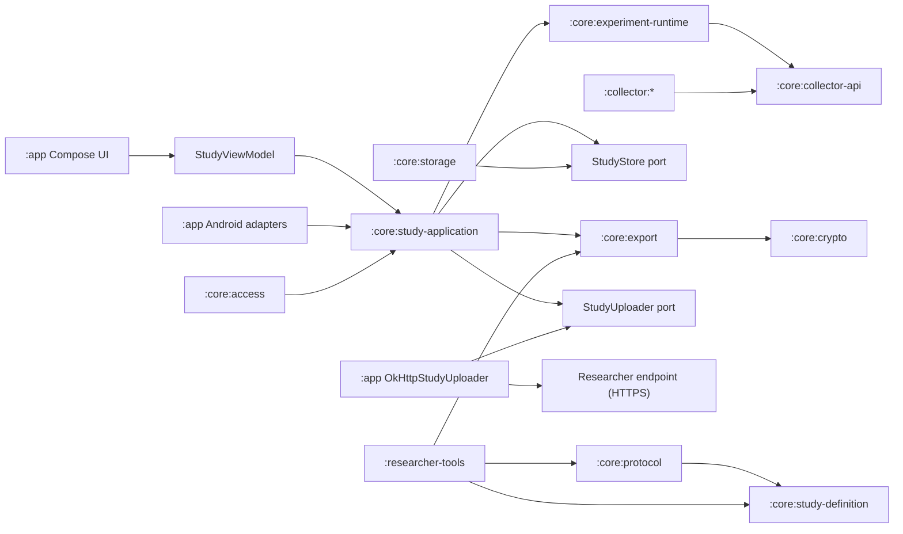
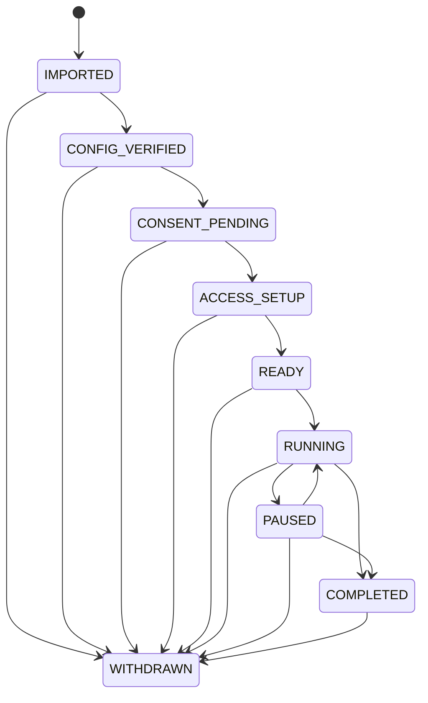

# Android Data Collector system design

This document describes the system as it exists in this repository today, not a roadmap. The
platform is a local-first, single-study, participant-controlled Android data collection app. A
study configuration can only select collectors that are already compiled into the APK. It cannot
download or execute arbitrary code. Collection and storage never require the network; delivery to
a researcher endpoint is an option a study configuration turns on.

## 1. Goals and boundaries

- Android 14-17 (`minSdk 34`, `compileSdk`/`targetSdk 37`).
- A signed study configuration determines the study content, the collectors, their parameters, the
  prompts, the local storage quota, the export public key, and whether the study uploads.
- Every study event is encrypted on the device before it is stored, and nothing leaves the device
  in plaintext.
- Data reaches the researcher two ways: an export the participant directs, and — when the
  configuration carries a populated `upload` block — scheduled delivery of the same encrypted
  bundles to the endpoint it names. Both are ciphertext wrapped to the researcher's HPKE key.
  Upload is a property of the study, not a participant setting, and it is disclosed on the consent
  screen from the signed bytes.
- Collection begins only after the participant explicitly starts it. The participant can pause,
  resume, finish early, withdraw, export, and delete. Collection never depends on upload
  succeeding.
- `RUNNING`, `PAUSED`, `COMPLETED`, and `WITHDRAWN` can all be exported, repeatedly. Export is not a
  study state.

### Outside the current scope

For readers sizing up what a study can and cannot do, the following are not implemented, and no
study configuration can turn them on:

- Touch data exists only inside the study keyboard; there is no system-wide touch monitoring and no
  accessibility service.
- The study IME does not record characters, committed text, surrounding text, clipboard content, or
  suggestions.
- Network collectors read connection state and device-total counters. No SSID, BSSID, IP address,
  DNS query, URL, packet, or payload is recorded.
- Nothing external can start, stop, or reconfigure a running study. Upload is outbound only: the
  worker posts a bundle and uses the response status code, and no inbound message reaches the
  runtime.
- Collectors store raw sensor readings and derive no activity or posture labels from them.

## 2. Module architecture



| Module | Responsibility |
| --- | --- |
| `:app` | Compose interface and its localized string resources, bounded UI state, SAF, and the Android foreground/work/recovery/upload adapters |
| `:core:model` | Bounded study metadata, the state and event model, and the `StudyStore` port with its retained-window contract |
| `:core:study-definition` | Strict canonical JSON, closed-world typed study and collector configuration |
| `:core:protocol` | Signed envelope, signature verification, optional signer pinning, validity-window and version checks |
| `:core:collector-api` | Collector lifecycle, health, registry, access contract, and the shared callback dispatcher |
| `:core:crypto` | Tink HPKE key handling, wrapping, and unwrapping |
| `:core:access` | Runtime permission, Usage Access, input-method, and hardware preflight |
| `:core:experiment-runtime` | Command serialization, state machine, collector supervision, event admission gate |
| `:core:study-application` | The single active-study session; recovery and coordination of the storage/access/host/work/export/upload ports, and the upload watermark |
| `:core:storage` | Android Keystore, encrypted metadata, appended event segments, reclaiming delivered ones, recovery |
| `:core:export` | Streaming JSON/AES-GCM over a requested sequence window under an optional plaintext budget, HPKE key wrapping, and receipts |
| `:collector:*` | One independent module per data source |
| `:researcher-tools` | CLI for Ed25519/HPKE key generation, canonicalization, signing, configuration checking, and decryption (`signing-keygen`, `hpke-keygen`, `canonicalize`, `sign`, `check-config`, `decrypt`) |

A collector feature depends on `collector-api` and `study-definition` and nothing else in the module
graph. It emits through `EventSink` only. It cannot see storage or the runtime, change state
directly, write files, export, or request permissions. `CollectorRegistry` rejects an ID that is not
compiled in, and rejects duplicate IDs at construction.

### The participant interface

`CollectorDashboard.kt` renders the whole participant surface from `StudyUiState`. Setup is a fixed
sequence of five steps — study, data, consent, access, start — mapped from the study state by
`setupStep`, with exactly one panel on screen at a time and a row of dots for position; the step
names exist only as that row's content description, since sighted readers get position from the dots
and content from the panel. `CONSENT_PENDING` covers two of those steps, data and consent, and
re-entering it resets to the data step, so the agreement checkbox is never reached without the list
of sources having been shown. Once setup is over the header shows the study state and elapsed time
instead, and the panel becomes collector health, an event meter, and the lifecycle controls.

`CollectorSummary.kt` is what the data step renders: one template per collector type, filled from
the signed configuration's own parameters, plus a fixed per-collector line naming what that source
cannot see. It is app-authored text with no configuration field behind it — see
[`threat-model.md`](threat-model.md).

Every participant-facing string is a resource; none is written into Kotlin. The app ships English
(the default) and Traditional Chinese, declared in `res/xml/locales_config.xml` and referenced by
the manifest's `android:localeConfig`. `AppLocale` reads the offered list from that manifest
declaration rather than from a second list in code, and its picker reads and writes
`LocaleManager.applicationLocales` — the same store Android's per-app language screen edits, so the
two cannot disagree, and an empty override means the app follows the system language. Adding a
language is a `values-*` directory and one line of XML. Researcher-supplied text — title, purpose,
researcher name, contact, and the consent summary — is never translated; it renders exactly as it
was signed.

## 3. Trust and configuration protocol

A study configuration is strict canonical JSON. Object fields must match the current schema exactly.
Unknown fields, unknown collectors, duplicate IDs, non-canonical encoding, and out-of-range numbers
are rejected outright. There is no guessing and no compatibility fallback.

The configuration is wrapped in an `ADCCFG01` binary envelope. All multi-byte integers in the binary
layouts in this document are big-endian.

```text
magic(8) | signerKeyIdLength(u16) | configLength(u32) |
signatureLength(u16) | signerKeyId | canonicalConfig | Ed25519Signature
```

The signing public key travels inside the signed bytes, as a mandatory root `signer` block of
`key_id` and a base64 X.509 Ed25519 `public_key`. A configuration therefore certifies itself, which
is what lets one published app verify any researcher's study.

Verification order:

1. Validate the envelope length and format.
2. Strictly decode the configuration and validate the schema and the collector parameters. Nothing
   decoded is acted on until step 5 passes.
3. Require `signer.key_id` to equal the envelope's `signerKeyId`.
4. Resolve the Ed25519 public key: the pinned key for that key ID if the build has one, otherwise
   the key the configuration declares.
5. Verify the signature over the raw canonical configuration bytes.
6. Check `issued_at <= now < expires_at` and `minimum_app_version`.
7. Confirm the Tink HPKE public keyset carried in the configuration can build a `HybridEncrypt`.

Steps 1-6 live in `ConfigurationVerifier`, which returns a `VerifiedConfiguration` — the
configuration plus `signerAnchored`. Step 7 is applied by the app's composition root when it
activates a configuration, so the `check-config` CLI covers steps 1-6 only.

`ConfigurationVerifier` takes a map of pinned signers, `CollectorApplication.TRUSTED_SIGNING_KEYS`.
Empty is the shipped default: any correctly signed configuration is accepted and `signerAnchored` is
false, and the consent screen asks the participant to check the signer fingerprint themselves. A
non-empty map is strictly exclusive — any signer not listed is rejected outright — and at step 4 the
pinned key wins over the declared one and must equal it, so a configuration cannot claim a pinned
key ID while carrying a different key.

What this establishes is that the configuration is unchanged since it was signed. It does not
establish who wrote it unless the build pins that signer; `SignerIdentity.fingerprint` (SHA-256 over
the encoded public key, first 16 bytes, as eight uppercase groups of four hex characters) is what a
participant compares against what the research team published. See
[`threat-model.md`](threat-model.md).

The researcher HPKE public key needs no separate distribution either: it sits inside the signed
bytes, so the same signature covers it. The signing private key and the HPKE private key have
separate purposes and must not be shared. A build embeds public keys only — and none at all unless
it pins a signer; it contains no study private key.

## 4. Study state machine



Every transition is persisted encrypted before the UI is updated. `ExperimentRuntime` serializes
commands behind a mutex, and an illegal transition returns a fixed reason code. Study time is
recorded three ways at once: UTC wall clock, `elapsedRealtimeNanos`, and a boot session ID.

There is no `EXPORTED` state. Export availability is:

| State | Exportable | State after export |
| --- | --- | --- |
| `RUNNING` | Yes | `RUNNING` |
| `PAUSED` | Yes | `PAUSED` |
| `COMPLETED` | Yes | `COMPLETED` |
| `WITHDRAWN` | Yes | `WITHDRAWN` |

`Delete local data` is allowed only in `COMPLETED` or `WITHDRAWN`. It deletes the active
configuration, the metadata, the event segments, and the associated Android Keystore entries. Files
the participant has already exported to external storage are outside the app's control.

## 5. Runtime and the pause boundary

Each entry into `RUNNING` mints a new epoch token in the admission gate. A collector must hold the
token before it can emit an event, and each event carries its original observation time. On pause,
finish, or withdraw:

1. Capture a monotonic boundary and switch the gate to `DRAINING`.
2. Persist the state transition first.
3. Stop callbacks and polling, then flush already-queued events.
4. Accept only events from the same epoch whose observation time precedes the boundary.
5. Close the epoch. Older tokens are permanently invalid.

This is why a pause cannot be polluted by new events arriving through a delayed callback queue. A
storage failure closes the gate immediately, records a fixed incident code, and attempts to fail
closed into `PAUSED`.

Each collector maintains its own health state: `STOPPED`, `ACTIVE`, `PAUSED`, `BLOCKED_ACCESS`, or
`FAILED`. A missing optional permission blocks only the collector that needs it. A missing required
permission prevents preflight from completing at all. One collector's failure does not stop the
others.

## 6. Implemented collectors

| Collector ID | Data | Access requirement |
| --- | --- | --- |
| `app_lifecycle.v1` | This app's own Activity lifecycle | None |
| `accelerometer.v1` | Raw x/y/z in m/s², sensor time, accuracy | Accelerometer hardware |
| `network_state.v1` | Default network availability, transport, validated, metered, roaming, VPN, optional bandwidth estimates | `ACCESS_NETWORK_STATE` (a manifest normal permission) |
| `network_usage.v1` | Device-total Wi‑Fi and mobile rx/tx bytes and packets, plus the interval the query covers | Usage Access |
| `usage_events.v1` | App resumed/paused/stopped, screen, keyguard, and startup/shutdown raw events, including the foreground app's `package_name` when the platform reports one | Usage Access |
| `location.v1` | Fused Location fixes: latitude, longitude, source time, accuracy, speed, altitude, bearing, mock flag | Fine and background location, per the `required` flags in the configuration |
| `keyboard_touch.v1` | Touch position relative to the bounds of the pressed key, timing, pressure, size, orientation, tool type, key category | The study input method must be enabled and selected |

Network state records no SSID, BSSID, IP address, DNS server, URL, packet, or payload. Network usage
is the coarse device total from Android's `NetworkStatsManager.querySummaryForDevice` with
`subscriberId=null`. It is not an instantaneous rate and not a per-app attribution.

The keyboard is a working English-letter QWERTY IME, but a study event from it contains no
characters, committed text, surrounding text, clipboard content, or suggestions. Password input
types and `IME_FLAG_NO_PERSONALIZED_LEARNING` disable touch collection entirely for that field.
Within-key touch positions still carry inference risk, so they must be disclosed explicitly in the
consent material.

## 7. Local storage

Each study uses one non-exportable Android Keystore AES-256-GCM key. The study ID is hashed with
SHA-256 into an opaque file and key locator. All data lives under `noBackupFilesDir/experiments`.
The manifest disables backup, and the cloud-backup and device-transfer rules exclude all app data.

- Metadata: an `AtomicFile` in the format `ADCMET01 | random 96-bit IV | ciphertext+tag`. `ADCMET01`
  carries the participant instance ID, the upload watermark, and the retained floor. It also holds
  `last_events`, the most recent event per collector, which is why opening a study needs no scan of
  the log to rebuild it. There is no fallback reader, so an `ADCMET01` file is refused rather than
  migrated.
- Events: `events-00000001.adcs` segments capped at 4 MiB. A segment is appended to and never
  rewritten; whole leading segments can be reclaimed once delivery is confirmed. At most
  `MAXIMUM_LIVE_SEGMENTS = 2048` are resident at once, which at 4 MiB each covers the largest
  permitted quota, so the quota is what binds in practice and the segment count stays a backstop.
  The index is monotone and never reused, bounded by `MAXIMUM_SEGMENT_INDEX = 1_000_000_000`.
- Each segment opens with a 12-byte header, `ADCEVT01 | segmentIndex(int32)`, which the reader
  checks against the index in the filename.
- Each frame: `sequence(u64) | ciphertextLength(u32) | random IV(12) | ciphertext+tag`.
- The AAD binds the event format, the opaque study locator, and the sequence number.
- Every event append is followed by an `fsync`; metadata is committed through `AtomicFile`.
- The active signed configuration is held separately, under its own Keystore key, as
  `ADCACT01 | random 96-bit IV | ciphertext+tag`.
- The local quota comes from the configuration and is bounded to 8 MiB-8 GiB. Encoded metadata is
  capped at `MAXIMUM_METADATA_BYTES` = 1 MiB, and an append must leave `METADATA_RESERVE_BYTES` =
  2 MiB of the quota free, so the metadata that names the last event that fits can always be
  rewritten.

A read requires the surviving segment indices and the event sequences to be contiguous among
themselves. They no longer have to start at index 1 or at sequence 1, because reclaiming removes
whole leading segments; the scan seeds its cursor from the first frame it finds. Only an incomplete
trailing frame in the last segment may be truncated, and only on the metadata-load path. A format
error, an AEAD verification failure, a truncation anywhere but the tail, a missing segment number,
or a missing key all fail closed. Nothing is skipped over.

### Opening a study, and reading a range

The sequence number sits unencrypted at the front of every frame, which is what lets both paths
skip work without giving up a check.

`loadMetadata` walks the frames and decrypts none of them (`scanEvents(…, decryptPayloads = false)`).
Framing, the segment index, and sequence contiguity come from the plaintext headers, and the
surviving sequence range is what the metadata is reconciled against. `lastEvents` — the last event
each collector recorded — is read from the encrypted metadata, where it is persisted, rather than
rebuilt by scanning. Opening a study is therefore linear in frames, with no per-event crypto and no
per-event JSON parsing, which is what makes an 8 GiB quota usable. The consequence is stated in the
[threat model](threat-model.md): an event payload is authenticated when it is read, not when the
study is opened. The metadata's own AEAD tag, the framing, and the contiguity of the sequence are
all still checked at open.

`readEvents` walks the same headers and decrypts only the frames at or above the requested start,
seeking past the rest. That matters beyond speed: an upload streams its bundle as it is generated,
so time spent decrypting events the window will discard is time the connection sits silent, and
that silence grows with the study's length until it outlasts the network. Measured on an emulator,
the same delivery took 90-149 s before this change and 31 s after.

### Reclaiming delivered data

Full local retention is the normal case. `ExperimentRuntime.reclaimLocalSpace()` does nothing until
a study's usage crosses `EVICT_ABOVE_FRACTION` (0.80) of its configured quota, and then reclaims
only down to `EVICT_DOWN_TO_FRACTION` (0.60). Both are constants in the runtime; a study
configuration has no field that changes them.

`StudySessionManager.commitUpload` calls it immediately after an endpoint confirms an upload,
because a confirmed delivery is the only thing that makes local data reclaimable.

`EvictionPlanner` in `:core:storage` chooses what goes. It is a pure function over segment
summaries — index, first sequence, size on disk — so the rules are tested on the JVM rather than
only on a device. A whole segment qualifies only when both of these hold:

1. **Every event in it was confirmed.** A segment runs to the next segment's first sequence minus
   one, so it is fully delivered when the next segment starts at or below
   `uploadedThroughSequence + 1`.
2. **It is not the newest segment.** That one is still being appended to, so its upper bound is
   unknown, and keeping it guarantees a reload always finds at least one event.

A collector's most recent event needs no special treatment. `lastEvents` is persisted in the study
metadata rather than rebuilt by scanning, so a polling collector keeps the timestamp it resumes from
even once the segment holding that event is gone. An earlier rule pinned any segment holding such an
event; it existed only to keep `lastEvents` rebuildable by scanning, and went with that.

Segments go oldest first and always form a contiguous leading run. Nothing undelivered is ever
reclaimed: when the quota fills and nothing qualifies, the write fails and the study fail-closes to
`PAUSED`, the same outcome a study without an endpoint reaches.

`StudyMetadata.retainedFromSequence` is the lowest sequence still on the device, and 1 when nothing
has been reclaimed. `eventCount` stays the lifetime total, and `nextSequenceNumber` comes from
persisted metadata rather than being recomputed from the scan, so a sequence number is never
reissued after reclaiming. The readable window is `[retainedFromSequence, eventCount]`.

The floor is persisted before the segments below it are unlinked. A crash in between leaves more on
disk than the floor claims, which is harmless: the load path adopts the first sequence it actually
finds, and the next pass finishes the job. Finding *less* on disk than the floor claims is fatal on
load — `Event segments below the retained floor are missing` — because it is indistinguishable from
a prefix having been tampered away.

`StudyStore` exposes this as two methods: `storageUsage(): StorageUsage`, and
`evictThrough(metadata, targetBytes): StudyMetadata`, which returns the metadata unchanged when
nothing qualified.

## 8. Export and upload

Both paths produce the same bundle. An `ExportSnapshot` carries `fromSequence`, an optional
`toSequence`, and an optional `maximumPlaintextBytes`; a participant export runs from
`retainedFromSequence` to `nextSequenceNumber - 1` with no budget, so their copy is complete, and an
upload asks for everything after the last sequence an endpoint confirmed under a 16 MiB budget. The
runtime hands out a copy of the bounded `StudyMetadata` only. The exporter reads the requested range
from the store one event at a time and streams JSON → AES-GCM → destination. It never loads the full
event history, the full plaintext JSON, or the full ciphertext into memory. During `RUNNING`, later
events keep appending with larger sequence numbers, which is why no pause is required for either
path.

No size failure can strand a study. The format previously enforced a 256 MiB plaintext ceiling by
throwing mid-stream, which under an 8 GiB quota was a permanent-failure state: once the undelivered
tail passed the ceiling, every upload regenerated the whole bundle and then threw, with no way
forward. The budget replaces that. A bundle stops cleanly at the first event boundary past the
budget — checked every `BUDGET_CHECK_STRIDE` = 256 events, so overshoot is bounded by one stride —
and always takes at least one event, so a run cannot make zero progress. The receipt reports where
it stopped, and the rest goes out on the next run.

Export uses the Storage Access Framework's `CreateDocument` so the participant chooses the
destination. Upload writes the same stream into an OkHttp request body; because the bundle is
generated as it is written its length is unknown up front, so `contentLength()` is `-1` and OkHttp
falls back to chunked transfer encoding. The body is one-shot, so OkHttp cannot replay it once
sending has started; `retryOnConnectionFailure` is left at its default, which then only recovers a
pooled connection that turns out to be dead before anything was written — a common case between
widely spaced uploads. WorkManager owns retry beyond that.

`ResearchExport.decrypt` streams as well, for the same reason: a bundle is bounded by the study's
quota rather than by a fixed ceiling, so it can be larger than a researcher's machine wants to hold
in memory. It drives the cipher directly rather than through `CipherInputStream`, which reports an
AEAD failure as a normal end of stream and would turn a tampered bundle into a silently truncated
file. The trade-off is that plaintext reaches the caller before the tag is verified, which is why
`researcher-tools decrypt` writes to a temporary file in the destination directory and moves it into
place only after `decrypt` returns.

Export format:

```text
ADCEXP01 | keyIdLength(u16) | wrappedKeyLength(u32) | nonce(12) |
researcherKeyId | TinkHPKEWrappedAESKey | AES-GCMCiphertext
```

- Content: `research-bundle-v1` JSON containing the canonical configuration, the snapshot time, the
  current state, the participant instance ID, all transitions, the events in the window, and then
  the bundle's own `first_sequence_number` and `last_sequence_number`. Those two sit *after* the
  `events` array, because a budget decides where a bundle stops while it streams; declaring the
  window up front would let a bundle claim a range it does not contain. A reader that needs the
  window before the events has to buffer or make a second pass.
- Content key: a freshly generated AES-256 key and 96-bit nonce for every bundle.
- Key wrapping: Tink HPKE, `DHKEM_X25519_HKDF_SHA256 / HKDF_SHA256 / AES_256_GCM`.
- The context and AAD bind the format string, `experimentId`, `configurationId`, and
  `researcherKeyId`. Because the format string is in the AAD, a reader built for another version
  fails on the tag rather than misreading the bundle.
- Receipt: key ID, first sequence, sequence boundary, event count, byte count, and the SHA-256 of
  the entire encrypted bundle.

A state can be exported any number of times, and each file uses a new random key. Repeated exports
normally overlap, so the research side should deduplicate on
`configuration_id + collector_id + sequence_number`. In a study that has reclaimed space, an export
starts at the retained floor instead of at 1 and its `first_sequence_number` says so, which makes
it a window over the events still on the device rather than the whole history. The wrong private
key, the wrong configuration, or any tampering with the header or the ciphertext leaves the bundle
undecryptable.

Upload advances a durable watermark rather than repeating history. `StudyMetadata.uploadedThroughSequence`
holds the highest sequence an endpoint confirmed; it starts at 0, advances only after a successful
response, and never moves backwards. There is no fixed chunk size. Each run asks for everything
outstanding — `[uploadedThroughSequence + 1, nextSequenceNumber - 1]` — the budget decides how much
of that fits, and the watermark follows `ExportReceipt.sequenceBoundary` rather than the range that
was planned. The configured interval is what paces delivery; the budget only binds while a backlog
is being worked off, and the next run picks up where the last one stopped.

The session lock is taken twice and briefly — once to compute the range, once to commit — with the
HTTP transfer in between under a separate mutex, so an unresponsive endpoint cannot block the
participant from pausing or withdrawing. A study withdrawn, deleted, or replaced while a request is
in flight discards the commit. Committing the watermark is also where reclaiming is attempted,
described in section 7.

A failed delivery sets a reason code on the upload state only; the participant-facing `incidentCode`
is left alone, so a transient network problem cannot bury a storage or access incident the
participant needs to act on. The code comes from `StudyUploadException`, which carries a fixed
identifier rather than a message and validates it against the same `[A-Z][A-Z0-9_]{2,63}` pattern as
a collector's health reason, so nothing that reaches a screen or a log can hold study data.
`OkHttpStudyUploader` classifies the transport failure into `UPLOAD_TIMEOUT`,
`UPLOAD_HOST_UNRESOLVED`, `UPLOAD_CONNECT_REFUSED`, `UPLOAD_TLS_HANDSHAKE_FAILED`,
`UPLOAD_TLS_FAILED`, `UPLOAD_INTERRUPTED`, `UPLOAD_IO_FAILED`, or `UPLOAD_FAILED`, and a non-2xx
response becomes `UPLOAD_HTTP_<status>`. The dashboard renders that code in place of the delivered
count, and a collector in `FAILED` or `BLOCKED_ACCESS` shows its own reason code the same way.

## 9. Background execution, prompts, and recovery

- `CollectionService` runs as a `specialUse` foreground service on start and resume. The `location`
  service type is added when a location collector is present and fine location has been granted.
- Pause, finish, withdraw, and delete stop the foreground service.
- `BOOT_COMPLETED` triggers process-scoped session initialization. The same recovery path
  re-verifies the signed envelope and loads the encrypted metadata. Collectors are constructed on
  every initialization, but the admission gate, collector activation, and the foreground service are
  restored only when the persisted state was `RUNNING`.
- Prompts are WorkManager one-time work, scheduled as a delay in minutes measured from the first
  start. The timing is not precise and is not guaranteed.
- The study deadline is a unique WorkManager job. On expiry it moves `RUNNING` or `PAUSED` to
  `COMPLETED`.
- `UploadWorker` is a self-renewing chain of unique one-time work rather than a
  `PeriodicWorkRequest`. Each link is enqueued with an initial delay of the configuration's
  `interval_minutes` and enqueues its successor when it finishes. The reason is that WorkManager's
  periodic floor is 15 minutes: silently clamping a shorter configured cadence would make the
  frequency stated on the consent screen untrue. The first link goes out alongside prompts and the
  deadline when the participant starts a study that declares an endpoint.
- Constraints are `NetworkType.UNMETERED` — `CONNECTED` when `allow_metered` is true — and
  `requiresBatteryNotLow`, with exponential backoff from 1 minute.
- The cost of a chain is that it has no platform-side repetition to fall back on. So
  `AndroidStudyWorkScheduler.reschedulePendingWork` re-establishes it whenever a session
  initialises, including after a boot, with `ExistingWorkPolicy.KEEP` so a link already waiting does
  not have its delay reset on every app start.
- The worker acts in `RUNNING`, `PAUSED`, `COMPLETED`, and `WITHDRAWN`, and no-ops in every other
  state or when the active study is not the one the job was scheduled for. Finishing or withdrawing
  cancels prompts and the deadline but leaves delivery running, so a study that has ended still
  sends its undelivered tail. The chain is simply not renewed once `uploadDrained()` reports that a
  terminal study has nothing outstanding; deleting local data cancels it outright.
- A failed run returns `Result.retry()` rather than `failure()`: the usual cause is a network or
  endpoint problem that resolves on its own, and the events remain durable on the device meanwhile.
  A retry keeps the current link alive, so no successor is enqueued on that path.

## 10. Security and privacy invariants

- No unsigned study configuration is accepted, and none whose signature, canonicality, schema,
  validity window, or app-version floor fails. A build that pins signers additionally refuses every
  signer it does not list.
- No dynamically downloaded collector, no parsing fallback, no legacy reader.
- No plaintext study file, no plaintext export scratch file, no secret key in a log.
- Study data leaves the device only as an HPKE-wrapped bundle, and only to a destination the
  participant chose or to the endpoint the signed configuration names. No analytics, no crash
  upload, no telemetry.
- An upload endpoint must be `https://` with a host, validated when the configuration is decoded,
  and `usesCleartextTraffic="false"` remains set. There is no certificate pinning; the device's
  system trust store is what the connection trusts.
- Upload is decided by the signed configuration, so it is covered by the same signature, expiry, and
  canonicality checks as the collector set. There is no runtime toggle and no way to redirect a
  study to a different endpoint without a new signature and fresh consent.
- The upload watermark only advances, only on a confirmed response, and only as far as the receipt
  says the bundle actually reached. A failed or hostile endpoint can delay delivery; it cannot cause
  events to be skipped or re-sent as a gap. It can, by confirming a bundle it did not keep, make
  those events reclaimable from the device under storage pressure — a 2xx is a statement that the
  body is durably stored.
- Both public keys travel inside the signed configuration; the study signing and export private keys
  belong in neither the app nor a production repository.
- Of the app's own components, only the launcher activity and the boot receiver and IME service that
  Android requires to be exported are system-discoverable. `CollectionService` is not exported. The
  merged release manifest additionally exports the permission-guarded AndroidX components that
  WorkManager and ProfileInstaller contribute.
- Withdrawal stops collection. It does not pretend to delete copies already exported off the device.
  Deletion and export are separate, explicit actions.

## 11. Verification scope

Automated tests cover the strict protocol and signature handling, the state machine, the admission
gate, runtime pause/resume and repeated export, HPKE and AES-GCM round trips with wrong-context and
wrong-suite rejection, and Android Keystore encrypted segmented storage. The eight protocol tests
include the self-certifying path with an empty anchor map, a populated map refusing every other
signer, a configuration that names a pinned key ID while carrying a substituted key, and an envelope
whose signer key ID disagrees with the one in the signed bytes. For upload they cover the
`upload` block round-tripping in both shapes and rejecting a partial or cleartext one, ranged bundles
carrying and declaring only their window, the watermark advancing on success and holding on failure,
a failure not masking a collection incident, an upload before collection starting as a no-op, a
finished study still delivering its backlog and then reporting itself drained, and a study without
an `upload` block never contacting an endpoint.

The budget and streaming decryption have their own export tests: a budget stopping at an event
boundary with the receipt naming that boundary and the bundle declaring the window it actually
holds, a snapshot with no budget sending everything it was asked for, and a one-byte change to a
finished bundle raising `AEADBadTagException` from the chunked decrypt path rather than yielding a
short file.

Reclaiming is covered on both sides of the split. `EvictionPlanner`'s rules have JVM tests: oldest
delivered segments first, a study under its target keeping everything, undelivered events blocking a
segment, the newest segment and a single-segment store never being reclaimed, and the chosen set always being a contiguous leading run. The encrypted store
adds instrumentation tests, on real Android Keystore, for segment rollover, reclaiming and reloading
from the new floor, appending after a reclaim without reusing a sequence, reclaimed events no longer
being readable, and a missing prefix that was not reclaimed refusing to open.

These areas are not covered by tests today, and should be read as unverified rather than as working:
trailing-frame recovery in the encrypted store, tampering with an `ADCEXP01` *header* rather than its
ciphertext, the withdraw path through `ExperimentRuntime` and `StudySessionManager`, and the two
Android-side upload classes — `OkHttpStudyUploader` and `UploadWorker` — whose request shaping,
failure classification, status-code handling, chain renewal, and WorkManager constraints have no test
of their own.

The instrumentation test defines the full Compose participation flow: importing the demo study under
the shipped empty anchor map, the study step, a Continue through the data step, consent, access
setup, start, pause with an assertion that no events are admitted during the pause, resume, and
finish through its confirmation dialog. It drives the setup steps by test tag, because the header
shows a position rather than a state name, and the two places it does assert on text — the
confirmation button and the terminal state — read it back through `getString`, so the test passes in
whatever language the device is set to rather than pinning one locale's wording. It runs against the
debug variant, which is the only one that carries the demo study — a release build compiles neither
the signed envelope nor its loader, so the entry point the test drives does not exist there. It
scrolls to the export control but does not perform an export. It has to actually run on an
emulator or a device; assembling the test APK is not a device-test pass.

Before real recruitment, a study still needs study-specific testing on the target physical devices
and OEMs: permissions, background restrictions, battery, storage volume, location accuracy, Usage
Access, the study keyboard, and long-duration stress. Passing on an emulator is not IRB or ethics
approval, not Google Play policy approval, and not scientific validity.
