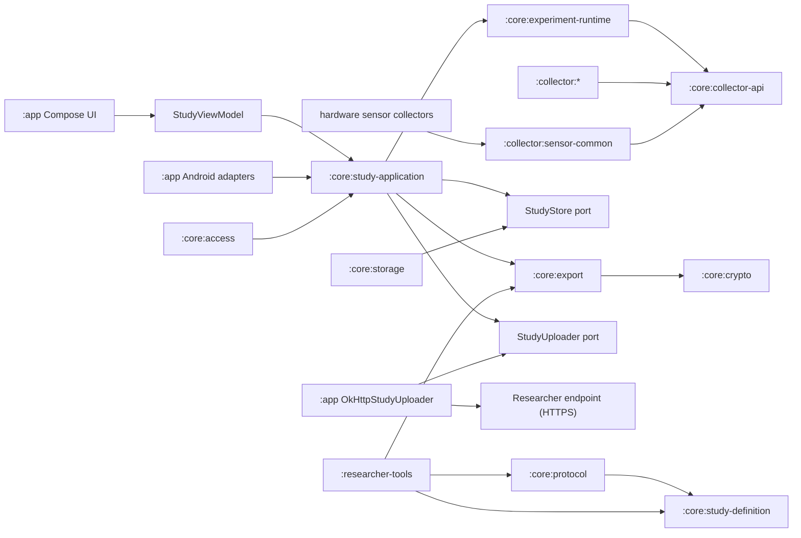
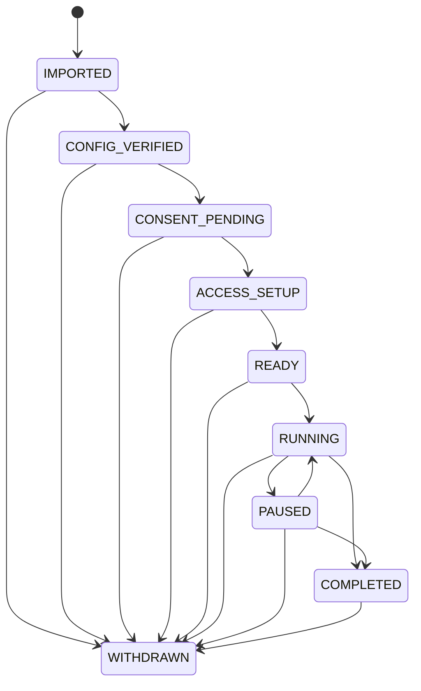

# Android Data Collector system design

This document describes the system as it exists in this repository today, not a roadmap. The
platform is a local-first, single-study, participant-controlled Android data collection app. A
study configuration can only select collectors that are already compiled into the APK. It cannot
download or execute arbitrary code. Collection and storage never require the network; delivery to
a researcher endpoint is an option a study configuration turns on.

The [normative Protocol v1 contract](../protocol/v1/README.md) and its
[collector catalog](../protocol/v1/collector-catalog.json) define the wire and event schemas. The
[P0–P2 implementation contract](p0-p2-implementation-contract.md) records the locked decisions, and
[`assurance`](../assurance/README.md) defines the static Collector capability policy. This document
explains how the current modules realize those contracts.

## 1. Goals and boundaries

- Android 14-17 (`minSdk 34`, `compileSdk`/`targetSdk 37`).
- A signed v1 study configuration determines study content, participant identity mode, collectors,
  localized surveys, intervention actions and triggers, local storage quota, export key, and upload.
- Every study event is encrypted on the device before it is stored, and nothing leaves the device
  in plaintext.
- Data reaches the researcher two ways: an export the participant directs, and — when the
  configuration carries a populated `upload` block — scheduled delivery of the same encrypted
  bundles to the endpoint it names. Both are ciphertext wrapped to the researcher's HPKE key.
  Upload is a property of the study, not a participant setting, and it is disclosed on the consent
  screen from the signed bytes.
- Collection begins only after the participant explicitly starts it. The participant can pause,
  resume, finish early, withdraw, export, and delete. Collection never depends on upload
  succeeding.
- `RUNNING`, `PAUSED`, `COMPLETED`, and `WITHDRAWN` can all be exported, repeatedly. Export is not a
  study state.

### Outside the current scope

For readers sizing up what a study can and cannot do, the following are not implemented, and no
study configuration can turn them on:

- Touch data exists only inside the study keyboard; there is no system-wide touch monitoring and no
  accessibility service.
- The study IME does not record characters, committed text, surrounding text, clipboard content, or
  suggestions.
- Network collectors read connection state and device-total counters. No SSID, BSSID, IP address,
  DNS query, URL, packet, or payload is recorded.
- Nothing external can start, stop, or reconfigure a running study. Upload is outbound only: the
  worker posts a bundle and uses the response status code, and no inbound message reaches the
  runtime.
- Collectors store raw sensor readings and derive no activity or posture labels from them.

## 2. Module architecture



| Module | Responsibility |
| --- | --- |
| `:app` | Compose interface and localized resources, bounded UI state, SAF, Android foreground/work/recovery adapters, single-entry upload outbox, and HTTP adapter |
| `:core:model` | Bounded study metadata, the state and event model, and the `StudyStore` port with its retained-window contract |
| `:core:study-definition` | Strict canonical JSON, closed-world typed study and collector configuration |
| `:core:protocol` | Signed envelope, immutable join URI, signature verification, optional signer pinning, validity-window and version checks |
| `:core:collector-api` | Collector lifecycle, health, registry, access contract, and the shared callback dispatcher |
| `:core:crypto` | Protocol v1 raw-key Ed25519 verification and fixed-suite RFC 9180 HPKE over raw X25519 keys; Tink remains internal only, never a wire keyset |
| `:core:access` | Runtime permission, Usage Access, input-method, and hardware preflight |
| `:core:experiment-runtime` | Command serialization, state machine, collector supervision, event admission gate, durable occurrence lifecycle, and atomic survey submission |
| `:core:study-application` | The single active-study session; recovery and coordination of storage/access/host/work/export/upload ports, schedule reconciliation, and the upload watermark |
| `:core:storage` | Android Keystore, encrypted metadata, appended event segments, reclaiming delivered ones, and strict one-event journal recovery |
| `:core:export` | Authenticated JCS/AES-GCM bundle construction over an exact sequence window, HPKE wrapping, closed-world streaming bundle verification, provenance, and strict receipt parsing |
| `:collector:*` | One independent module per data source |
| `:collector:sensor-common` | Listener-thread ownership shared only by raw Android hardware-sensor collectors; no schema, inference, or storage policy |
| `:researcher-tools` | CLI for Ed25519/HPKE key generation, canonicalization, signing, configuration checking, and decryption (`signing-keygen`, `hpke-keygen`, `canonicalize`, `sign`, `check-config`, `decrypt`) |

A collector feature depends on `collector-api`, `study-definition`, and, for raw hardware listener
ownership only, `collector:sensor-common`. This is the sole collector-to-collector dependency and
the capability policy scans it with the feature modules. A collector emits through `EventSink`
only. It cannot see storage or the runtime, change state directly, write files, export, or request
permissions.
`CollectorRegistry` rejects an ID that is not compiled in, and rejects duplicate IDs at
construction.

### The participant interface

`CollectorDashboard.kt` renders the whole participant surface from `StudyUiState`. Setup is a fixed
sequence of five steps — study, data, consent, access, start — mapped from the study state by
`setupStep`, with exactly one panel on screen at a time and a row of dots for position; the step
names exist only as that row's content description, since sighted readers get position from the dots
and content from the panel. `CONSENT_PENDING` covers two of those steps, data and consent, and
re-entering it resets to the data step, so the agreement checkbox is never reached without the list
of sources having been shown. Once setup is over the header shows the study state and elapsed time
instead, and the panel becomes collector health, an event meter, and the lifecycle controls.

`CollectorSummary.kt` is what the data step renders: one template per collector type, filled from
the signed configuration's own parameters, plus a fixed per-collector line naming what that source
cannot see. It is app-authored text with no configuration field behind it — see
[`threat-model.md`](threat-model.md).

Every participant-facing string is a resource; none is written into Kotlin. The app ships English
(the default) and Traditional Chinese, declared in `res/xml/locales_config.xml` and referenced by
the manifest's `android:localeConfig`. `AppLocale` reads the offered list from that manifest
declaration rather than from a second list in code, and its picker reads and writes
`LocaleManager.applicationLocales` — the same store Android's per-app language screen edits, so the
two cannot disagree, and an empty override means the app follows the system language. Adding a
language is a `values-*` directory and one line of XML. Researcher-supplied text — title, purpose,
researcher name, contact, and the consent summary — is never translated; it renders exactly as it
was signed.

## 3. Trust and configuration protocol

A study configuration is strict RFC 8785 JCS. Object fields must match the current schema exactly.
Unknown fields, unknown collectors, duplicate IDs, noncanonical bytes, malformed UTF-8,
non-integral or out-of-range numbers, and trailing bytes are rejected. Sequence/time/build values
are canonical decimal strings. Protocol v1 is a destructive pre-1.0 definition: artifacts from the
former v1 implementation have no fallback reader.

The configuration is wrapped in an `ADCCFG01` binary envelope. All multi-byte integers in the binary
layouts in this document are big-endian.

```text
magic(8) | signerKeyIdLength(u16) | configLength(u32) |
signerKeyId | canonicalConfig | Ed25519Signature(64)
```

The signing public key travels inside the signed bytes, as a mandatory root `signer` block of
`key_id` and an unpadded-base64url raw 32-byte Ed25519 `public_key`. The export block similarly
carries a raw 32-byte X25519 key. X.509, PKCS#8, Tink JSON/protobuf keysets, padded base64, and
standard-base64 are invalid wire values. A configuration therefore certifies itself, which
is what lets one published app verify any researcher's study.

Verification order:

1. Validate the envelope length and format.
2. Strictly decode and exactly re-encode the JCS configuration; validate schema, Android platform,
   raw keys, collector parameters, and `minimum_client_version`. Nothing decoded is acted on until
   the signature passes.
3. Require `signer.key_id` to equal the envelope's `signerKeyId`.
4. Resolve the Ed25519 public key: the pinned key for that key ID if the build has one, otherwise
   the key the configuration declares.
5. Verify the signature over the raw canonical configuration bytes.
6. Check `issued_at <= now < expires_at`, platform, and the client build floor.

These checks live in `ConfigurationVerifier`, which returns a `VerifiedConfiguration` containing
the exact canonical bytes, signer key ID and signature, configuration SHA-256, typed configuration,
and `signerAnchored`. That preserved provenance is embedded and reverified in every bundle.

`ConfigurationVerifier` takes a map of pinned signers, `CollectorApplication.TRUSTED_SIGNING_KEYS`.
Empty is the shipped default: any correctly signed configuration is accepted and `signerAnchored` is
false, and the consent screen asks the participant to check the signer fingerprint themselves. A
non-empty map is strictly exclusive — any signer not listed is rejected outright — and at step 4 the
pinned key wins over the declared one and must equal it, so a configuration cannot claim a pinned
key ID while carrying a different key.

What this establishes is that the configuration is unchanged since it was signed. It does not
establish who wrote it unless the build pins that signer; `SignerIdentity.fingerprint` (SHA-256 over
the raw public key, first 16 bytes, as eight uppercase groups of four hex characters) is what a
participant compares against what the research team published. See
[`threat-model.md`](threat-model.md).

The researcher HPKE public key needs no separate distribution either: it sits inside the signed
bytes, so the same signature covers it. The signing private key and the HPKE private key have
separate purposes and must not be shared. A build embeds public keys only — and none at all unless
it pins a signer; it contains no study private key.

### Immutable join import

`adc://join/v1` is an immutable transport pointer, not remote configuration. Its fixed query binds
one canonical HTTPS artifact URL, the full envelope SHA-256, and the signer fingerprint. Kotlin and
TypeScript consume one shared corpus and enforce a narrow ASCII URL profile instead of accepting
different normalization from `URI` and WHATWG `URL`. Android handles only the exact exported
`VIEW` filter, rejects an active study before network I/O, performs one bounded non-redirecting GET,
and removes no-backup staging on startup and every outcome. The session then checks digest,
ordinary `ADCCFG01` signature / configuration rules, and fingerprint in that order. The host can
withhold bytes but cannot replace an accepted artifact, schedule a refresh, change collectors, or
assign a participant ID through the link.

## 4. Study state machine



Every transition is persisted encrypted before the UI is updated. `ExperimentRuntime` serializes
commands behind a mutex, and an illegal transition returns a fixed reason code. Study time is
recorded three ways at once: UTC wall clock, `elapsedRealtimeNanos`, and a boot session ID.

There is no `EXPORTED` state. Export availability is:

| State | Exportable | State after export |
| --- | --- | --- |
| `RUNNING` | Yes | `RUNNING` |
| `PAUSED` | Yes | `PAUSED` |
| `COMPLETED` | Yes | `COMPLETED` |
| `WITHDRAWN` | Yes | `WITHDRAWN` |

`Delete local data` is allowed only in `COMPLETED` or `WITHDRAWN`. It deletes the active
configuration, the metadata, the event segments, and the associated Android Keystore entries. Files
the participant has already exported to external storage are outside the app's control.

## 5. Runtime and the pause boundary

Each entry into `RUNNING` mints a new epoch token in the admission gate. A collector must hold the
token before it can emit an event, and each event carries its original observation time. On pause,
finish, or withdraw:

1. Capture a monotonic boundary and switch the gate to `DRAINING`.
2. Persist the state transition first.
3. Stop callbacks and polling, then flush already-queued events.
4. Accept only events from the same epoch whose observation time precedes the boundary.
5. Close the epoch. Older tokens are permanently invalid.

This is why a pause cannot be polluted by new events arriving through a delayed callback queue. A
storage failure closes the gate immediately, records a fixed incident code, and attempts to fail
closed into `PAUSED`.

Each collector maintains its own health state: `STOPPED`, `ACTIVE`, `PAUSED`, `BLOCKED_ACCESS`, or
`FAILED`. A missing optional permission blocks only the collector that needs it. A missing required
permission prevents preflight from completing at all. One collector's failure does not stop the
others.

## 6. Implemented collectors

| Collector ID | Data | Access requirement |
| --- | --- | --- |
| `app_lifecycle.v1` | This app's own Activity lifecycle | None |
| `accelerometer.v1` | Raw x/y/z in m/s², sensor time, accuracy | Accelerometer hardware |
| `battery_state.v1` | Whole percentage, charging state/source, power-save state | None |
| `temporal_context.v1` | Time-zone ID, UTC offset, DST state, clock-change reason | None |
| `gyroscope.v1` | Raw x/y/z angular velocity in rad/s, sensor time, accuracy | Gyroscope hardware |
| `ambient_light.v1` | Raw illuminance in lux, sensor time, accuracy | Ambient-light hardware |
| `proximity.v1` | Raw distance/range and near/far interpretation | Proximity hardware |
| `network_state.v1` | Default network availability, transport, validated, metered, roaming, VPN, optional bandwidth estimates | `ACCESS_NETWORK_STATE` (a manifest normal permission) |
| `network_usage.v1` | Device-total Wi‑Fi and mobile rx/tx bytes and packets, plus the interval the query covers | Usage Access |
| `usage_events.v1` | App resumed/paused/stopped, screen, keyguard, and startup/shutdown raw events, including the foreground app's `package_name` when the platform reports one | Usage Access |
| `location.v1` | Fused Location fixes: latitude, longitude, source time, accuracy, speed, altitude, bearing, mock flag | Fine and background location, per the `required` flags in the configuration |
| `keyboard_touch.v1` | Touch position relative to the bounds of the pressed key, timing, pressure, size, orientation, tool type, key category | The study input method must be enabled and selected |

Network state records no SSID, BSSID, IP address, DNS server, URL, packet, or payload. Network usage
is the coarse device total from Android's `NetworkStatsManager.querySummaryForDevice` with
`subscriberId=null`. It is not an instantaneous rate and not a per-app attribution.

The keyboard is a working English-letter QWERTY IME, but a study event from it contains no
characters, committed text, surrounding text, clipboard content, or suggestions. Password input
types and `IME_FLAG_NO_PERSONALIZED_LEARNING` disable touch collection entirely for that field.
Within-key touch positions still carry inference risk, so they must be disclosed explicitly in the
consent material.

## 7. Local storage

Each study uses one non-exportable Android Keystore AES-256-GCM key. The study ID is hashed with
SHA-256 into an opaque file and key locator. All data lives under `noBackupFilesDir/experiments`.
The manifest disables backup, and the cloud-backup and device-transfer rules exclude all app data.
The app neither requests StrongBox nor verifies hardware backing, so this is a Keystore isolation
claim, not an absolute hardware-protection claim.

- Metadata: an `AtomicFile` in the format `ADCMET01 | random 96-bit IV | ciphertext+tag`. `ADCMET01`
  carries the fresh-per-import instance ID, optional researcher-assigned ID, upload watermark,
  retained floor, and durable intervention occurrence states. It also holds
  `last_events`, the most recent event per collector, which is why opening a study needs no scan of
  the log to rebuild it. There is no fallback reader, so an `ADCMET01` file is refused rather than
  migrated.
- Events: `events-00000001.adcs` segments capped at 4 MiB. A segment is appended to and never
  rewritten; whole leading segments can be reclaimed once delivery is confirmed. At most
  `MAXIMUM_LIVE_SEGMENTS = 2048` are resident at once, which at 4 MiB each covers the largest
  permitted quota, so the quota is what binds in practice and the segment count stays a backstop.
  The index is monotone and never reused, bounded by `MAXIMUM_SEGMENT_INDEX = 1_000_000_000`.
- Each segment opens with a 12-byte header, `ADCEVT01 | segmentIndex(int32)`, which the reader
  checks against the index in the filename.
- Each frame: `sequence(u64) | ciphertextLength(u32) | random IV(12) | ciphertext+tag`.
- The AAD binds the event format, the opaque study locator, and the sequence number.
- Every event append is followed by an `fsync`; metadata is committed through `AtomicFile`.
- An event plus its resulting metadata is one recoverable commit. Before appending, the store writes
  an encrypted `ADCTXN01` journal containing the resulting metadata before the event append.
  If the journal is one boundary ahead and its event is durable, recovery authenticates that exact
  tail event and commits the journal metadata; if the event is absent, it discards the prepared
  journal. A same-boundary leftover is discarded with main metadata authoritative. Any other
  boundary, malformed journal, or event mismatch fails closed. This is the one write path used for
  occurrence lifecycle events and survey submissions; there is no independent draft store.
- The active signed configuration is held separately, under its own Keystore key, as
  `ADCACT01 | random 96-bit IV | ciphertext+tag`.
- The local quota comes from the configuration and is bounded to 8 MiB-8 GiB. Encoded metadata is
  capped at `MAXIMUM_METADATA_BYTES` = 1 MiB, and an append must leave `METADATA_RESERVE_BYTES` =
  2 MiB of the quota free, so the metadata that names the last event that fits can always be
  rewritten.

A read requires the surviving segment indices and the event sequences to be contiguous among
themselves. They no longer have to start at index 1 or at sequence 1, because reclaiming removes
whole leading segments; the scan seeds its cursor from the first frame it finds. Only an incomplete
trailing frame in the last segment may be truncated, and only on the metadata-load path. A format
error, an AEAD verification failure, a truncation anywhere but the tail, a missing segment number,
or a missing key all fail closed. Nothing is skipped over.

### Opening a study, and reading a range

The sequence number sits unencrypted at the front of every frame, which is what lets both paths
skip work without giving up a check.

`loadMetadata` normally walks the frames with `scanEvents(…, decryptPayloads = false)`. Framing, the
segment index, and sequence contiguity come from the plaintext headers, and the surviving sequence
range is what the metadata is reconciled against. Only the unique state where a one-boundary-ahead
journal and its complete event tail are both durable causes a second header walk and decrypts that
single tail event before committing its metadata. `lastEvents` — the last event each collector
recorded — is persisted inside encrypted metadata rather than rebuilt by scanning. Opening is thus
linear in frames with no per-event crypto or JSON parsing; normal opening decrypts no events and
crash recovery decrypts at most one. The consequence is stated in the [threat model](threat-model.md):
event payloads are authenticated when read, plus the one recovery tail when required. Metadata AEAD,
framing, and sequence contiguity are always checked at open.

`readEvents` walks the same headers and decrypts only the frames at or above the requested start,
seeking past the rest. That keeps manual export and durable upload staging proportional to the
requested retained window instead of repeatedly decrypting an already delivered prefix.

### Reclaiming delivered data

Full local retention is the normal case. `ExperimentRuntime.reclaimLocalSpace()` does nothing until
a study's usage crosses `EVICT_ABOVE_FRACTION` (0.80) of its configured quota, and then reclaims
only down to `EVICT_DOWN_TO_FRACTION` (0.60). Both are constants in the runtime; a study
configuration has no field that changes them.

`StudySessionManager.commitUpload` calls it immediately after an endpoint confirms an upload,
because a confirmed delivery is the only thing that makes local data reclaimable.

`EvictionPlanner` in `:core:storage` chooses what goes. It is a pure function over segment
summaries — index, first sequence, size on disk — so the rules are tested on the JVM rather than
only on a device. A whole segment qualifies only when both of these hold:

1. **Every event in it was confirmed.** A segment runs to the next segment's first sequence minus
   one, so it is fully delivered when the next segment starts at or below
   `uploadedThroughSequence + 1`.
2. **It is not the newest segment.** That one is still being appended to, so its upper bound is
   unknown, and keeping it guarantees a reload always finds at least one event.

A collector's most recent event needs no special treatment. `lastEvents` is persisted in the study
metadata rather than rebuilt by scanning, so a polling collector keeps the timestamp it resumes from
even once the segment holding that event is gone. An earlier rule pinned any segment holding such an
event; it existed only to keep `lastEvents` rebuildable by scanning, and went with that.

Segments go oldest first and always form a contiguous leading run. Nothing undelivered is ever
reclaimed: when the quota fills and nothing qualifies, the write fails and the study fail-closes to
`PAUSED`, the same outcome a study without an endpoint reaches.

`StudyMetadata.retainedFromSequence` is the lowest sequence still on the device, and 1 when nothing
has been reclaimed. `eventCount` stays the lifetime total, and `nextSequenceNumber` comes from
persisted metadata rather than being recomputed from the scan, so a sequence number is never
reissued after reclaiming. The readable window is `[retainedFromSequence, eventCount]`.

The floor is persisted before the segments below it are unlinked. A crash in between leaves more on
disk than the floor claims, which is harmless: the load path adopts the first sequence it actually
finds, and the next pass finishes the job. Finding *less* on disk than the floor claims is fatal on
load — `Event segments below the retained floor are missing` — because it is indistinguishable from
a prefix having been tampered away.

`StudyStore` exposes this as two methods: `storageUsage(): StorageUsage`, and
`evictThrough(metadata, targetBytes): StudyMetadata`, which returns the metadata unchanged when
nothing qualified.

## 8. Export and upload

Both paths use `ResearchExport` and the same authenticated document schema. A manual export reads
`[retainedFromSequence, nextSequenceNumber - 1]` and streams directly to the participant's Storage
Access Framework destination, so it may scale to the configured 8 GiB local quota. An automatic
upload first selects an exact non-empty window near a 16 MiB plaintext target, while enforcing a
32 MiB automatic-upload container ceiling.

Automatic upload does not stream a newly generated request. `FileUploadOutbox` creates the complete
ciphertext in no-backup storage, flushes and atomically publishes it, then persists a bounded
recovery manifest with bundle ID, exact first/last sequence, event count, byte count, configuration
digest, ciphertext SHA-256, and an optional terminal code. It contains no participant, experiment,
or configuration ID. At most one entry exists. Recovery
accepts it only when manifest, length, digest, and outer framing agree. Process death, reboot, I/O retry, or lost response reuses
the same file byte-for-byte; a new bundle cannot supersede it until an exact receipt commits it.

The HTTP body is therefore replayable, has fixed `Content-Length` and `Content-Digest`, and is never
chunked. Automatic redirects and OkHttp connection-level request replay are disabled; the outbox
and worker own retry semantics. Collection and later manual export can continue while the staged
file is pending.

`ResearchExport.decrypt` streams as well, for the same reason: a bundle is bounded by the study's
quota rather than by a fixed ceiling, so it can be larger than a researcher's machine wants to hold
in memory. It drives the cipher directly rather than through `CipherInputStream`, which reports an
AEAD failure as a normal end of stream and would turn a tampered bundle into a silently truncated
file. Plaintext therefore reaches only a mode-`0600` staging file before the tag is verified.
`researcher-tools decrypt` then streams that file through
[`ResearchBundleVerifier`](../core/export/src/main/kotlin/cool/linc/androiddatacollector/core/export/ResearchBundleVerifier.kt)
and publishes it
with an atomic move only after the authenticated document, signature, identities, ranges,
transitions, and catalog payloads all pass.

Export format:

```text
ADCEXP01 | bundleId(16) | configurationSha256(32) | keyIdLength(u16) |
contentNonce(12) | researcherKeyId | HPKEWrappedContentKey(80) | AES-GCMCiphertext
```

- Content: one closed-world JCS `research-bundle-v1` document containing the outer bundle identity,
  manual/automatic kind, exact embedded configuration, configuration digest and original signature,
  producer platform/build, snapshot time, full study metadata, transitions, and the exact contiguous
  event window. Sequence, count, time, and client-build values are decimal strings.
- Content key: a freshly generated AES-256 key and 96-bit nonce for every bundle.
- Key wrapping: RFC 9180 base mode with X25519/HKDF-SHA256/AES-256-GCM. The fixed 80-byte wire
  value is `enc[32] || sealed_key[48]`; library-specific keysets or prefixes never appear.
- Context: exact JCS containing bundle format, bundle UUID, full configuration SHA-256, and
  researcher key ID. It is HPKE `info` and document AES-GCM AAD.
- Validation: framing and bounds, HPKE, content AEAD, JCS, outer/inner identities, embedded
  configuration digest/signature/platform/build, exact range/count, and catalog payloads all pass
  before plaintext-derived output is published.

A state can be exported any number of times, and each file uses a new random key. Repeated exports
normally overlap, so the research side partitions by `(experiment_id, configuration_id)` and
deduplicates on `(participant_instance_id, sequence_number)`, treating different content at one
identity as a conflict. In a study that has reclaimed space, an export
starts at the retained floor instead of at 1 and its `first_sequence_number` says so, which makes
it a window over the events still on the device rather than the whole history. The wrong private
key, the wrong configuration, or any tampering with the header or the ciphertext leaves the bundle
undecryptable.

Upload advances a durable watermark rather than repeating history. `StudyMetadata.uploadedThroughSequence`
holds the highest sequence an endpoint confirmed; it starts at 0, advances only after a successful
receipt, and never moves backwards. Requests use `application/vnd.adc.research-bundle` plus bundle
UUID, format, configuration SHA-256, researcher key ID, exact from/to/count, length, and digest
headers. There are no clear participant, assigned, experiment, or configuration IDs; routing
metadata is explicitly untrusted.

A new durable object succeeds only with `201 Created`; an exact replay succeeds only with `200 OK`.
Both return the same compact JCS receipt with exactly `bundle_id`, `byte_count`,
`configuration_sha256`, `event_count`, `first_sequence_number`, `last_sequence_number`, and
`sha256`. Every value must equal the outbox manifest before commit. Receipt loss is safe because an
exact replay returns the original receipt; a bundle-ID/content conflict is terminal rather than an
overwrite.

The session lock is taken twice and briefly — once to compute the range, once to commit — with the
HTTP transfer in between under a separate mutex, so an unresponsive endpoint cannot block the
participant from pausing or withdrawing. A study withdrawn, deleted, or replaced while a request is
in flight discards the commit. Committing the watermark is also where reclaiming is attempted,
described in section 7.

A failed delivery sets a reason code on the upload state only; the participant-facing `incidentCode`
is left alone, so a transient network problem cannot bury a storage or access incident the
participant needs to act on. The code comes from `StudyUploadException`, which carries a fixed
identifier rather than a message and validates it against the same `[A-Z][A-Z0-9_]{2,63}` pattern as
a collector's health reason, so nothing that reaches a screen or a log can hold study data.
`OkHttpStudyUploader` classifies the transport failure into `UPLOAD_TIMEOUT`,
`UPLOAD_HOST_UNRESOLVED`, `UPLOAD_CONNECT_REFUSED`, `UPLOAD_TLS_HANDSHAKE_FAILED`,
`UPLOAD_TLS_FAILED`, `UPLOAD_INTERRUPTED`, `UPLOAD_IO_FAILED`, or `UPLOAD_FAILED`, and an HTTP error
becomes `UPLOAD_HTTP_<status>`. Only I/O, `408`, `425`, `429`, and `5xx` retry. Redirects, `202`,
every other `4xx`, malformed receipts, and mismatched receipts are terminal for the staged bundle,
without stopping collection or advancing the watermark. The dashboard renders that code in place
of the delivered count, and a collector in `FAILED` or `BLOCKED_ACCESS` shows its own reason code
the same way.

## 9. Background execution, interventions, and recovery

- `CollectionService` runs as a `specialUse` foreground service on start and resume. The `location`
  service type is added when a location collector is present and fine location has been granted.
- Pause, finish, withdraw, and delete stop the foreground service.
- `BOOT_COMPLETED` triggers process-scoped session initialization. The same recovery path
  re-verifies the signed envelope and loads the encrypted metadata. Collectors are constructed on
  every initialization, but the admission gate, collector activation, and the foreground service are
  restored only when the persisted state was `RUNNING`.
- Each intervention combines a reusable action with one or more triggers. Actions are localized
  notifications or localized native surveys. Triggers are one-time offsets, repeating intervals,
  daily local times, or signed random local windows. Relative triggers declare whether elapsed
  study time means calendar time or active collecting time. WorkManager timing is inexact and
  delivery can be late.
- `InterventionSchedulePlanner` derives every occurrence ID from configuration, intervention,
  trigger, and logical schedule position. Daily-local logical positions are stable indexes;
  random-window positions include the current-zone local date selected for a not-yet-materialized
  slot. Once materialized, an occurrence ID and instant are durable and independent of later zone
  changes or process history. The durable occurrence record owns its scheduled instant, expiry, and lifecycle
  (`SCHEDULED`, `POSTING`, `NOTIFICATION_POSTED`, `OPENED`, `SURVEY_SUBMITTED`, `EXPIRED`). Recovery,
  boot, time changes, timezone changes, pause, and resume reconcile by that identity, so they do not
  enqueue a second logical occurrence. A configuration is bounded to 512 lifetime occurrences so
  this exact durable set remains inside the encrypted metadata ceiling.
- Prompt lifecycle mutations are accepted only in `RUNNING`. Pause cancels pending intervention
  work and visible prompt notifications without freezing calendar time or signed availability;
  resume reconciles the durable set, expires elapsed windows, and schedules only still-eligible
  occurrences. Survey answers cannot be opened or submitted during the pause.
- Random-window triggers use a CSPRNG and persist the chosen instant before WorkManager receives
  it. Restart and retry reuse that record. Time/time-zone changes leave materialized occurrences
  unchanged and affect only future local dates. Caps truncate eligible slots in local-date planning
  order, then signed window array order, then ordinal; randomness selects only the minute within a
  selected slot. No server can trigger or redraw an occurrence.
- A notification content intent carries only the exact occurrence ID. Opening resolves its signed
  action from durable state. Survey answers validate against stable survey/question/option IDs and
  commit as one immutable `SURVEY_SUBMITTED` event plus terminal occurrence state. Closing the UI
  before that commit persists no answer or draft.
- The study deadline is a unique WorkManager job. On expiry it moves `RUNNING` or `PAUSED` to
  `COMPLETED`.
- `UploadWorker` is a self-renewing chain of unique one-time work rather than a
  `PeriodicWorkRequest`. Each link is enqueued with an initial delay of the configuration's
  `interval_minutes` and enqueues its successor when it finishes. The reason is that WorkManager's
  periodic floor is 15 minutes: silently clamping a shorter configured cadence would make the
  frequency stated on the consent screen untrue. The first link goes out alongside interventions and the
  deadline when the participant starts a study that declares an endpoint.
- Constraints are `NetworkType.UNMETERED` — `CONNECTED` when `allow_metered` is true — and
  `requiresBatteryNotLow`, with exponential backoff from 1 minute.
- The cost of a chain is that it has no platform-side repetition to fall back on. So
  `AndroidStudyWorkScheduler.reschedulePendingWork` re-establishes it whenever a session
  initialises, including after a boot, with `ExistingWorkPolicy.KEEP` so a link already waiting does
  not have its delay reset on every app start.
- The worker acts in `RUNNING`, `PAUSED`, `COMPLETED`, and `WITHDRAWN`, and no-ops in every other
  state or when the active study is not the one the job was scheduled for. Finishing or withdrawing
  cancels interventions and the deadline but leaves delivery running, so a study that has ended still
  sends its undelivered tail. The chain is simply not renewed once `uploadDrained()` reports that a
  terminal study has nothing outstanding; deleting local data cancels it outright.
- A retryable run returns `Result.retry()` and keeps the immutable outbox entry. A terminal protocol
  or receipt failure is persisted explicitly and does not spin forever; collection remains
  independent and the staged ciphertext is not acknowledged or reclaimed.

## 10. Security and privacy invariants

- No unsigned study configuration is accepted, and none whose signature, canonicality, schema,
  validity window, platform, or client-build floor fails. A build that pins signers additionally refuses every
  signer it does not list.
- No dynamically downloaded collector, no parsing fallback, no legacy reader.
- The current shape remains schema v1. Earlier prompt-shaped v1 configurations are rejected; there
  is no compatibility decoder or schema-version alias.
- Automatic upload URLs and headers exclude participant, assigned, experiment, and configuration
  IDs. Routing exposes only bundle-level claims and does not authenticate a participant or device.
- No plaintext study file, no plaintext export scratch file, no secret key in a log.
- Study data leaves the device only as an HPKE-wrapped bundle, and only to a destination the
  participant chose or to the endpoint the signed configuration names. No analytics, no crash
  upload, no telemetry.
- An upload endpoint must be `https://` with a host, validated when the configuration is decoded,
  and `usesCleartextTraffic="false"` remains set. There is no certificate pinning; the device's
  system trust store is what the connection trusts.
- Upload is decided by the signed configuration, so it is covered by the same signature, expiry, and
  canonicality checks as the collector set. There is no runtime toggle and no way to redirect a
  study to a different endpoint without a new signature and fresh consent.
- The upload watermark advances only for a `201 Created` or exact-replay `200 OK` whose canonical
  seven-member receipt matches the durable outbox manifest. `202`, redirects, generic `2xx`, and
  malformed or mismatched receipts never commit or make events reclaimable.
- Both public keys travel inside the signed configuration; the study signing and export private keys
  belong in neither the app nor a production repository.
- Of the app's own components, only the launcher activity and the boot receiver and IME service that
  Android requires to be exported are system-discoverable. `CollectionService` is not exported. The
  merged release manifest additionally exports the permission-guarded AndroidX components that
  WorkManager and ProfileInstaller contribute.
- Withdrawal stops collection. It does not pretend to delete copies already exported off the device.
  Deletion and export are separate, explicit actions.

## 11. Verification scope

Protocol behavior is executable in the shared valid/hostile
[conformance corpus](../protocol/v1/conformance-vectors.json). The neighbouring Kotlin
[configuration](../core/protocol/src/test/kotlin/cool/linc/androiddatacollector/core/protocol/ConfigurationProtocolTest.kt)
and [bundle](../core/export/src/test/kotlin/cool/linc/androiddatacollector/core/export/ResearchExportTest.kt)
tests cover JCS, raw keys, fixed framing, signature provenance, RFC 9180 context, exact ranges, and
wrong-key/context/tamper rejection; TypeScript consumes the same corpus. Runtime tests cover the
state machine, admission barrier, repeated export, watermark commit, and encrypted segmented
storage.

Schedule tests cover calendar and active-time one-shots, intervals, daily local time, durable CSPRNG
random windows across restart/time-zone/date-line changes, explicit DST gap/overlap resolution,
separation/caps, terminal occurrences, and pause accounting. Runtime tests cover all
four survey question types, required/optional validation, stable IDs without labels, expiry, and
concurrent submission proving exactly one immutable event. Identity tests cover distinct import
instance IDs, assigned-ID persistence/export, upload-header exclusion, CLI bulk uniqueness, and
cross-language canonical bytes.

Upload reliability has focused tests for the
[single-entry outbox](../app/src/test/kotlin/cool/linc/androiddatacollector/platform/FileUploadOutboxTest.kt)
and [HTTP adapter](../app/src/test/kotlin/cool/linc/androiddatacollector/platform/OkHttpStudyUploaderTest.kt):
recovery, exact byte replay, digest/length/range identity, redirect refusal, retry classification,
`201`/exact-replay `200`, generic-`2xx` rejection, and exact seven-field receipt matching. Export
tests separately verify streaming manual decryption publishes no successful output after AEAD
failure.

Reclaiming is covered on both sides of the split. `EvictionPlanner`'s rules have JVM tests: oldest
delivered segments first, a study under its target keeping everything, undelivered events blocking a
segment, the newest segment and a single-segment store never being reclaimed, and the chosen set always being a contiguous leading run. The encrypted store
adds instrumentation tests, on real Android Keystore, for segment rollover, reclaiming and reloading
from the new floor, appending after a reclaim without reusing a sequence, reclaimed events no longer
being readable, and a missing prefix that was not reclaimed refusing to open.

Collector admission has two complementary checks. The runtime enforces each descriptor's
`maximumEncodedEventBytes` before append, while CI executes the source, bytecode, and dependency
capability policy.

The instrumentation test defines the full Compose participation flow: importing the demo study under
the shipped empty anchor map, the study step, a Continue through the data step, consent, access
setup, start, pause with an assertion that no events are admitted during the pause, resume, and
finish through its confirmation dialog. It drives the setup steps by test tag, because the header
shows a position rather than a state name, and the two places it does assert on text — the
confirmation button and the terminal state — read it back through `getString`, so the test passes in
whatever language the device is set to rather than pinning one locale's wording. It runs against the
debug variant, which is the only one that carries the demo study — a release build compiles neither
the signed envelope nor its loader, so the entry point the test drives does not exist there. It
scrolls to the export control but does not perform an export. It has to actually run on an
emulator or a device; assembling the test APK is not a device-test pass.

Two narrower Android regressions sit beside that UI flow. `AndroidConfigurationImportTest`
proves raw-key Ed25519 demo import on Android itself, so a JCA provider-order
regression cannot hide behind JVM-only protocol tests. `P2CollectorEmulatorTest` creates the five P2
plugins against real Android broadcast and `SensorManager` surfaces, validates every emitted draft
against its Protocol v1 descriptor, and checks pause/resume/stop boundaries. It skips when the test
device lacks gyro, light, or proximity hardware; its explicit `p2SyntheticInputs=true` mode requires
host-side emulator injection and checks the fixed readings documented in the root README.

Before real recruitment, a study still needs study-specific testing on the target physical devices
and OEMs: permissions, background restrictions, battery, storage volume, location accuracy, Usage
Access, the study keyboard, and long-duration stress. Passing on an emulator is not IRB or ethics
approval, not Google Play policy approval, and not scientific validity.
